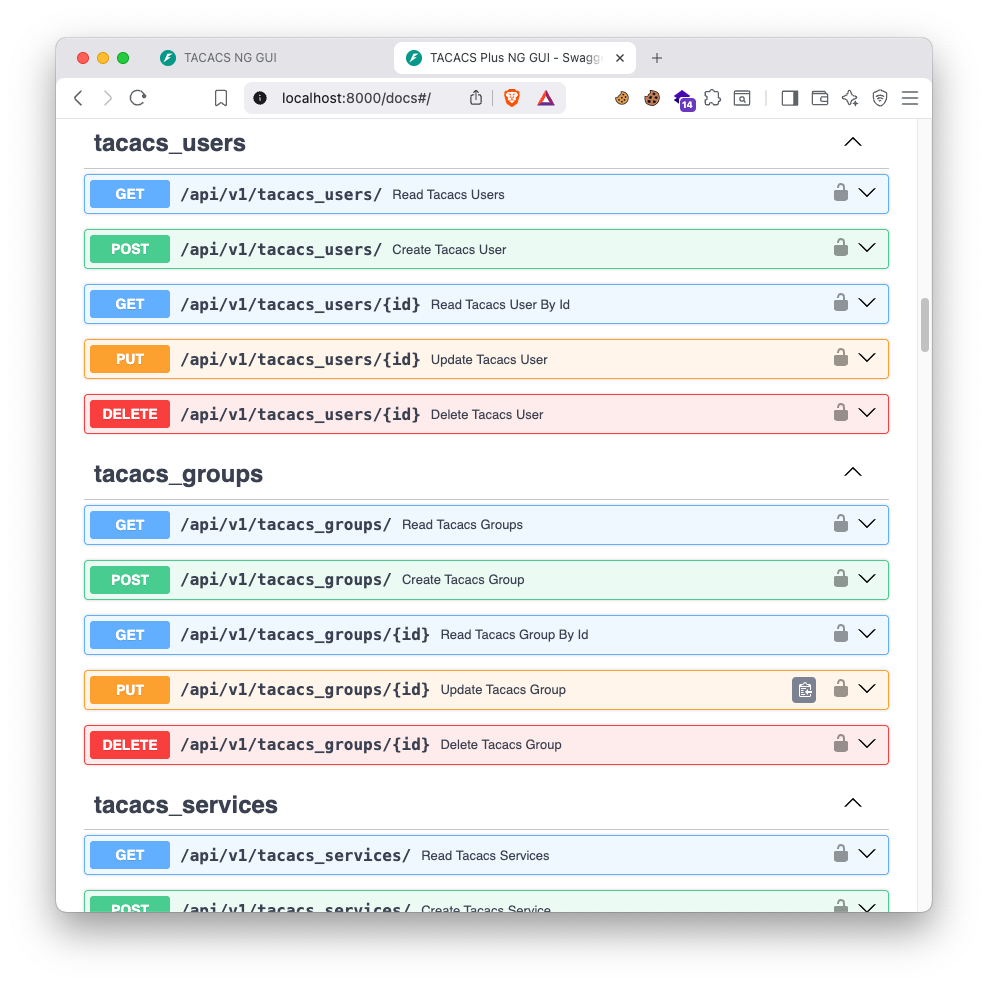
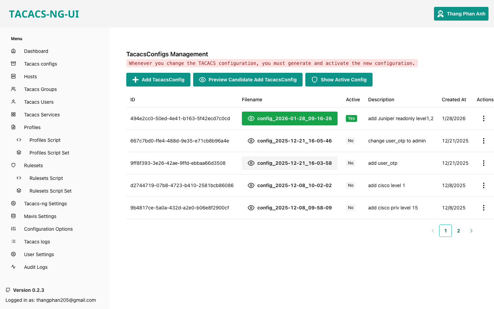
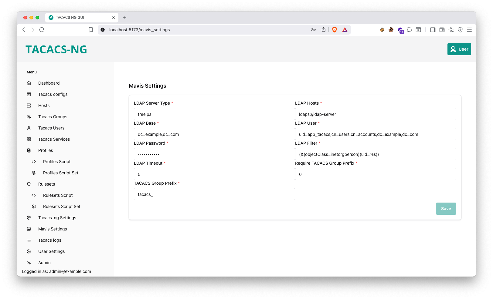

# TACACS-NG-GUI

## Technology Stack and Features

- ⚡ [**FastAPI**](https://fastapi.tiangolo.com) for the Python backend API.
  - 🧰 [SQLModel](https://sqlmodel.tiangolo.com) for the Python SQL database interactions (ORM).
  - 🔍 [Pydantic](https://docs.pydantic.dev), used by FastAPI, for the data validation and settings management.
  - 💾 [PostgreSQL](https://www.postgresql.org) as the SQL database.
- 🚀 [React](https://react.dev) for the frontend.
  - 💃 Using TypeScript, hooks, Vite, and other parts of a modern frontend stack.
  - 🎨 [Chakra UI](https://chakra-ui.com) for the frontend components.
  - 🤖 An automatically generated frontend client.
  - 🧪 [Playwright](https://playwright.dev) for End-to-End testing.
  - 🦇 Dark mode support.
- 🐋 [Docker Compose](https://www.docker.com) for development and production.
- 🔒 Secure password hashing by default.
- 🔑 JWT (JSON Web Token) authentication.
- 📫 Email based password recovery.
- ✅ Tests with [Pytest](https://pytest.org).
- 📞 [Traefik](https://traefik.io) as a reverse proxy / load balancer.
- 🚢 Deployment instructions using Docker Compose, including how to set up a frontend Traefik proxy to handle automatic HTTPS certificates.
- 🏭 CI (continuous integration) and CD (continuous deployment) based on GitHub Actions.

## How To Use It

```bash
git clone https://github.com/thangphan205/tacacs-ng-gui
cd tacacs-ng-gui
docker compose up -d
```

Access: <http://localhost:5173> with default account:
Username: <admin@example.com>
Password: ooG5adij3achohgai6eeceiY5jee4oCh

Development URLs, for local development.

Frontend: <http://localhost:5173>

Backend: <http://localhost:8000>

Automatic Interactive Docs (Swagger UI): <http://localhost:8000/docs>

Automatic Alternative Docs (ReDoc): <http://localhost:8000/redoc>

Adminer: <http://localhost:8080>

Traefik UI: <http://localhost:8090>

MailCatcher: <http://localhost:1080>

### Configure

You can then update configs in the `.env` files to customize your configurations.

Before deploying it, make sure you change at least the values for:

- `SECRET_KEY`
- `FIRST_SUPERUSER_PASSWORD`
- `POSTGRES_PASSWORD`

You can (and should) pass these as environment variables from secrets.

Read the [deployment.md](./deployment.md) docs for more details.

### Generate Secret Keys

Some environment variables in the `.env` file have a default value of `changethis`.

You have to change them with a secret key, to generate secret keys you can run the following command:

```bash
python3 -c "import secrets; print(secrets.token_urlsafe(32))"
```

Copy the content and use that as password / secret key. And run that again to generate another secure key.

## Backend Development

Backend docs: [backend/README.md](./backend/README.md).

## Frontend Development

Frontend docs: [frontend/README.md](./frontend/README.md).

## Deployment

Deployment docs: [deployment.md](./deployment.md).

## Development

General development docs: [development.md](./development.md).

This includes using Docker Compose, custom local domains, `.env` configurations, etc.

### Docs API

[](https://github.com/thangphan205/tacacs-ng-gui)

### Tacacs Config File Generator

[](https://github.com/thangphan205/tacacs-ng-gui)

### Tacacs Mavis Settings

[](https://github.com/thangphan205/tacacs-ng-gui)

## Release Notes

Check the file [release-notes.md](./release-notes.md).

## License

This project use <https://github.com/fastapi/full-stack-fastapi-template> as a template.

The Full Stack FastAPI Template is licensed under the terms of the MIT license.
