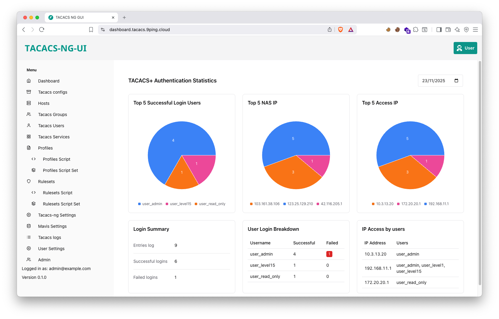
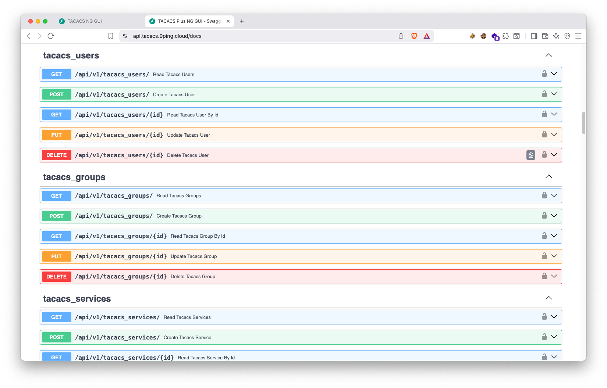
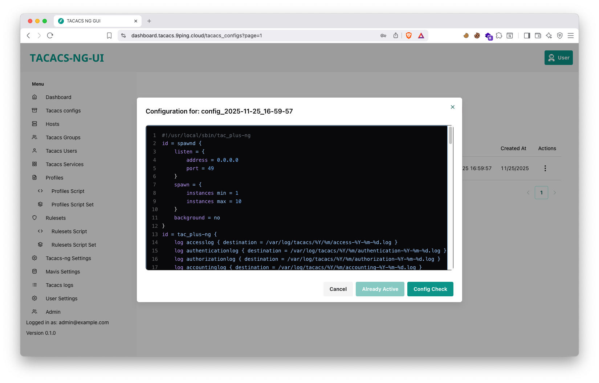
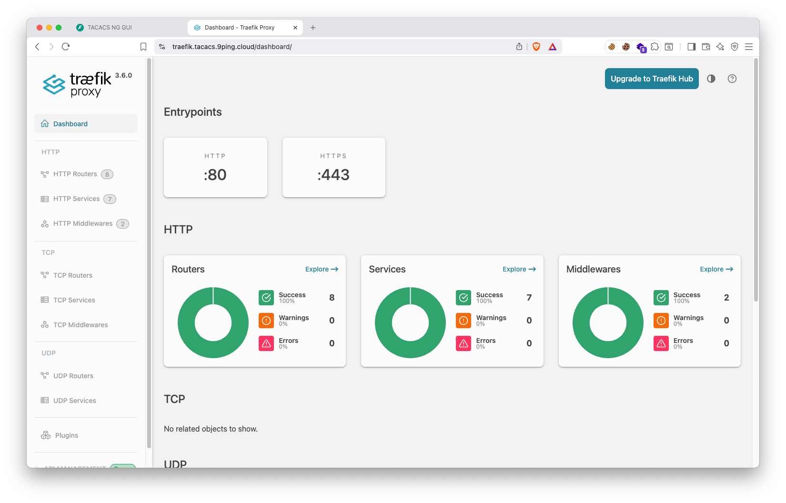
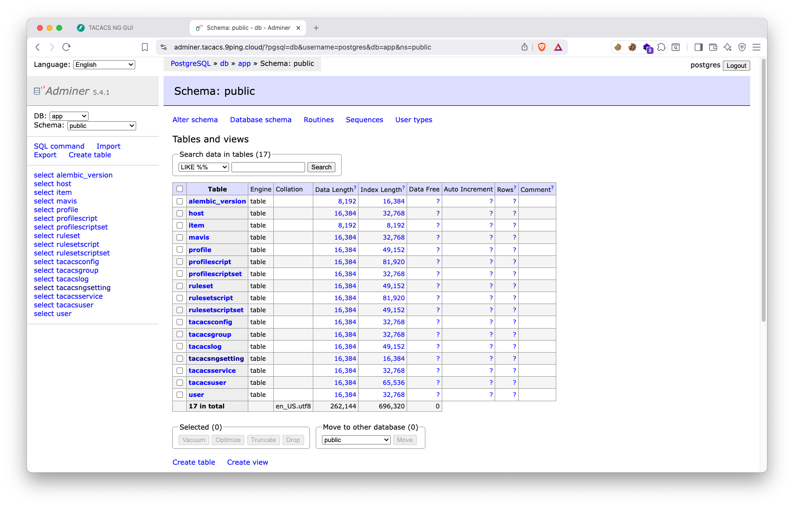

# TACACS-NG-UI

**tacacs-ng-ui** is a modern, full-stack web application that provides a user-friendly graphical interface for managing TACACS+ server configurations. It simplifies the administration of network device authentication, authorization, and accounting (AAA) by offering a clean and intuitive web-based dashboard.

Built with a powerful and modern technology stack, the application features a FastAPI backend and a React frontend. This combination ensures a high-performance, scalable, and maintainable solution for network administrators.

## Key Features

- Intuitive Web Interface: Manage TACACS+ users, groups, and policies through a clean and responsive UI built with React and Chakra UI.
- **TACACS+ Server**: Utilizes [tac_plus-ng](https://github.com/MarcJHuber/event-driven-servers) as the backend TACACS+ server, a modern and actively maintained implementation.
- Secure by Design: Includes secure password hashing, JWT (JSON Web Token) authentication, and email-based password recovery.
- Integrated Tooling: Comes with Traefik for reverse proxying, automatic API documentation via Swagger UI, and end-to-end testing with Playwright.
- tacacs-ng-ui is designed to make TACACS+ management more accessible and efficient, reducing the reliance on command-line interfaces and complex configuration files.

## Live Demo

Video Demo: [English - Demo tacacs-ng-iu - Setup for Juniper Devices](https://youtu.be/MUGusXOFJBI)

Video Tiếng Việt:[tacacs-ng-ui - Demo - Cấu hình chứng thực tập trung với thiết bị Juniper](https://youtu.be/vnuZMcHxpH4)

You can signup an account and use this tacacs server to test with your simulator lab.

- **Dashboard:** <https://dashboard.tacacs.9ping.cloud>
- **IP TACACS Server:** Ping dashboard.tacacs.9ping.cloud to get IP TACACS Server.

```bash
ping dashboard.tacacs.9ping.cloud 
```

- **TACACS key:** `change_this`

**Demo Credentials:**

- **Admin User**
  - **Username:** `user_admin`
  - **Password:** `change_this`
- **Read-Only User**
  - **Username:** `user_read_only`
  - **Password:** `change_this`

## Juniper Config

```bash
# Example Juniper configuration for TACACS+

# 1. Define local user classes for TACACS+ users
set system login class read-only-local idle-timeout 15
set system login class read-only-local permissions view
set system login class read-only-local permissions view-configuration
set system login class super-user-local idle-timeout 15
set system login class super-user-local permissions all
set system login user tacacs_read_only uid 2001
set system login user tacacs_read_only class read-only-local
set system login user tacacs_super_user uid 2002
set system login user tacacs_super_user class super-user-local

# 2. Set authentication order to check TACACS+ first, then local password
set system authentication-order tacplus
set system authentication-order password

# 3. Configure the TACACS+ server details
set system tacplus-server <IP_TACACS_SERVER> port 49
set system tacplus-server <IP_TACACS_SERVER> secret <TACACS_SECRET_KEY>
set system tacplus-server <IP_TACACS_SERVER> source-address <DEVICE_SOURCE_IP>

# 4. Configure accounting to send logs to the TACACS+ server
set system accounting events login
set system accounting events change-log
set system accounting events interactive-commands
set system accounting destination tacplus server <IP_TACACS_SERVER> secret <TACACS_SECRET_KEY>
set system accounting destination tacplus server <IP_TACACS_SERVER> source-address <DEVICE_SOURCE_IP>
```

## Cisco config

```bash
# 1. Enable AAA (Authentication, Authorization, and Accounting)
aaa new-model

# 2. Define the TACACS+ server
tacacs server TACACS-9PING
  # IP address of your TACACS-NG-UI server
  address ipv4 <IP_TACACS_SERVER>
  # Shared secret key, must match the server configuration
  key <TACACS_SECRET_KEY>
  exit

# 3. Create a server group (best practice for redundancy)
aaa group server tacacs+ TACACS-GROUP
  server name TACACS-9PING
  exit

# 4. Configure Authentication, Authorization, and Accounting methods
# Use TACACS+ first, then fall back to the local database if the server is unreachable
aaa authentication login default group TACACS-GROUP local
aaa authorization exec default group TACACS-GROUP local
aaa accounting exec default start-stop group TACACS-GROUP
# Log all commands run in privileged (enable) mode
aaa accounting commands 15 default start-stop group TACACS-GROUP

# 5. Apply the authentication method to VTY lines (for SSH/Telnet)
line vty 0 4
  login authentication default
exit
```

## Arista Config

```bash
# 1. Define the TACACS+ server and shared key
# 'key 0' specifies the key is in clear text. For production, use an encrypted key.
tacacs-server host <IP_TACACS_SERVER> key 0 <TACACS_SECRET_KEY>
!
# 2. Create a server group for TACACS+ (best practice)
aaa group server tacacs+ TACACS_GROUP
  # Add the server to the group
  server <IP_TACACS_SERVER>
!
# 3. Configure Authentication, Authorization, and Accounting methods
# Use the TACACS+ group first, then fall back to the local database if unreachable.
aaa authentication login default group TACACS_GROUP local
aaa authorization exec default group TACACS_GROUP local
# Authorize all commands against the TACACS+ server for granular control.
aaa authorization commands all default group TACACS_GROUP local
# Log the start and stop of exec sessions for auditing.
aaa accounting exec default start-stop group TACACS_GROUP

# 4. (Optional) Specify the source interface for TACACS+ traffic.
ip tacacs source-interface Management0
```

## Technology Stack and Features

- ⚡ [**FastAPI**](https://fastapi.tiangolo.com) for the Python backend API.
  - 🧰 [SQLModel](https://sqlmodel.tiangolo.com) for the Python SQL database interactions (ORM).
  - 🔍 [Pydantic](https://docs.pydantic.dev), used by FastAPI, for the data validation and settings management.
  - 💾 [PostgreSQL](https://www.postgresql.org) as the SQL database.
- 🚀 [React](https://react.dev) for the frontend.
  - 💃 Using TypeScript, hooks, Vite, and other parts of a modern frontend stack.
  - 🎨 [Chakra UI](https://chakra-ui.com) for the frontend components.
  - 🤖 An automatically generated frontend client.
  - 🧪 [Playwright](https://playwright.dev) for End-to-End testing.
  - 🦇 Dark mode support.
- 🐋 [Docker Compose](https://www.docker.com) for development and production.
- 🔒 Secure password hashing by default.
- 🔑 JWT (JSON Web Token) authentication.
- 📫 Email based password recovery.
- ✅ Tests with [Pytest](https://pytest.org).
- 📞 [Traefik](https://traefik.io) as a reverse proxy / load balancer.
- 🚢 Deployment instructions using Docker Compose, including how to set up a frontend Traefik proxy to handle automatic HTTPS certificates.
- 🏭 CI (continuous integration) and CD (continuous deployment) based on GitHub Actions.

## How To Use It

```bash
git clone https://github.com/thangphan205/tacacs-ng-ui
cd tacacs-ng-ui
docker compose up -d
```

Access: <http://localhost:5173> with default account:
Username: <admin@example.com>
Password: ooG5adij3achohgai6eeceiY5jee4oCh

Development URLs, for local development.

Frontend: <http://localhost:5173>

Backend: <http://localhost:8000>

Automatic Interactive Docs (Swagger UI): <http://localhost:8000/docs>

Automatic Alternative Docs (ReDoc): <http://localhost:8000/redoc>

Adminer: <http://localhost:8080>

Traefik UI: <http://localhost:8090>

MailCatcher: <http://localhost:1080>

### Configure

You can then update configs in the `.env` files to customize your configurations.

Before deploying it, make sure you change at least the values for:

- `SECRET_KEY`
- `FIRST_SUPERUSER_PASSWORD`
- `POSTGRES_PASSWORD`

You can (and should) pass these as environment variables from secrets.

Read the [deployment.md](./deployment.md) docs for more details.

### Generate Secret Keys

Some environment variables in the `.env` file have a default value of `changethis`.

You have to change them with a secret key, to generate secret keys you can run the following command:

```bash
python3 -c "import secrets; print(secrets.token_urlsafe(32))"
```

Copy the content and use that as password / secret key. And run that again to generate another secure key.

## Backend Development

Backend docs: [backend/README.md](./backend/README.md).

## Frontend Development

Frontend docs: [frontend/README.md](./frontend/README.md).

## Deployment

Deployment docs: [deployment.md](./deployment.md).

## Development

General development docs: [development.md](./development.md).

This includes using Docker Compose, custom local domains, `.env` configurations, etc.

### Dashboard

[](https://github.com/thangphan205/tacacs-ng-ui)

### Docs API

[](https://github.com/thangphan205/tacacs-ng-ui)

### Tacacs Config File Generator

[](https://github.com/thangphan205/tacacs-ng-ui)

### Traefik

[](https://github.com/thangphan205/tacacs-ng-ui)

### adminer

[](https://github.com/thangphan205/tacacs-ng-ui)

## Release Notes

Check the file [release-notes.md](./release-notes.md).

## License

This project use <https://github.com/fastapi/full-stack-fastapi-template> as a template.

The Full Stack FastAPI Template is licensed under the terms of the MIT license.
