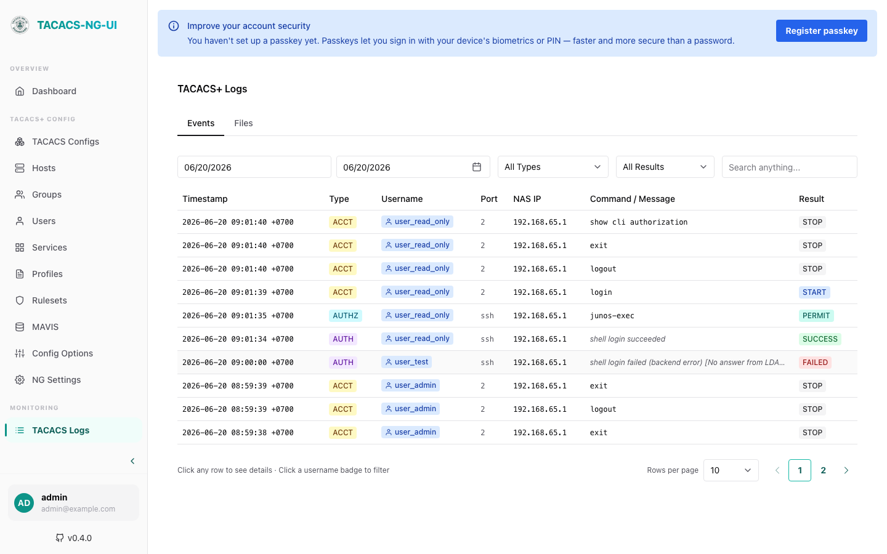
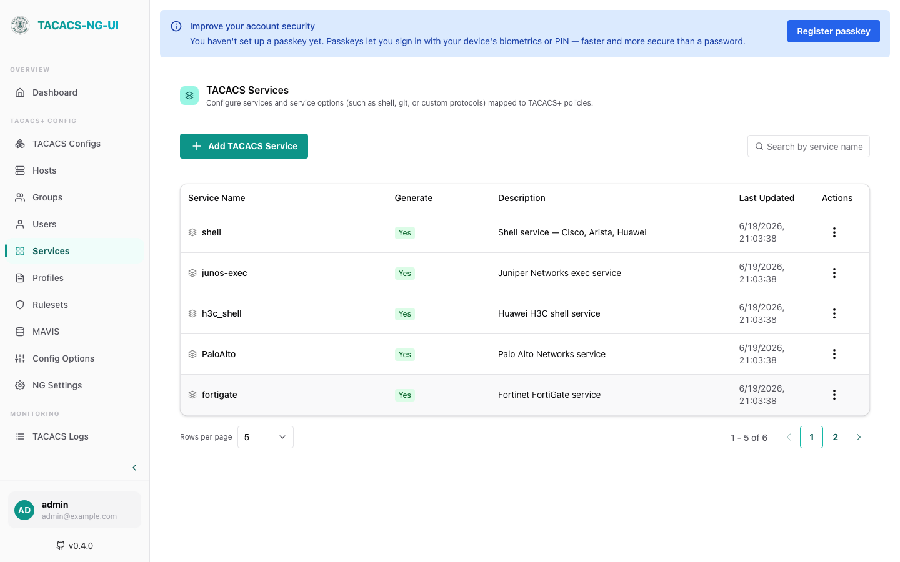

# TACACS-NG-UI

<div align="center">

🌐 **Language / Ngôn ngữ:** [🇬🇧 English](./README.md) | [🇻🇳 Tiếng Việt](./README.vi.md)

</div>

---

<p align="center">
  
</p>

<div align="center">

[](https://fastapi.tiangolo.com)
[](https://react.dev)
[](https://chakra-ui.com)
[](https://www.docker.com)
[](https://opensource.org/licenses/MIT)

</div>

---

### What is TACACS-NG-UI?

**tacacs-ng-ui** is a next-generation full-stack web application designed to simplify the administration and management of [tac_plus-ng](https://github.com/MarcJHuber/event-driven-servers), the modern event-driven TACACS+ daemon. 

Historically, managing TACACS+ servers required manually editing complex configuration files, leading to human errors, auditing challenges, and security loopholes. **tacacs-ng-ui** bridges this gap by providing:
1. **Dynamic Web Management**: Manage TACACS+ users, groups, profiles, hosts, and authorization policies through a responsive, premium UI built with React and Chakra UI.
2. **Versioned Config Engine**: Compile and validate configuration snapshots directly from the UI. Features side-by-side diff comparisons, error syntax checking, and safe version rollbacks.
3. **Observability & Log Auditing**: Monitor authentication, authorization, and accounting (AAA) stats in real-time, complete with a timeline view of auditing logs and user command histories.
4. **Automated Threat Alerting**: Real-time alert rule evaluations paired with Machine Learning (IsolationForest) anomaly detection to secure infrastructure against abnormal activities.

## Table of Contents

- [Key Features](#key-features)
- [Live Demo](#live-demo)
- [Device Configuration Examples](#device-configuration-examples)
  - [Juniper Config](#juniper-config)
  - [Cisco Config](#cisco-config)
  - [Arista Config](#arista-config)
- [Technology Stack](#technology-stack-and-features)
- [How To Use It](#how-to-use-it)
- [Deployment](#deploy-on-a-localhost)
  - [Deploy on localhost](#deploy-on-a-localhost)
  - [Deploy on remote server](#deploy-on-a-remote-server)
  - [Deploy with domain name](#deploy-on-a-remote-server-with-domain-name)
  - [High Availability (HA)](#high-availability-ha-deployment)
- [User Guide](#user-guide)
- [Development](#backend-development)
- [Screenshots](#screenshots)
- [Roadmap](#future-works--research-roadmap)
- [Release Notes](#release-notes)
- [License](#license)

---

## Key Features

- **Intuitive Web Interface**: Manage TACACS+ users, groups, and policies through a clean and responsive UI built with React and Chakra UI. Every management table has a unified premium layout with live search, sort, and pagination.
- **TACACS+ Server**: Utilizes [tac_plus-ng](https://github.com/MarcJHuber/event-driven-servers) as the backend TACACS+ server, a modern and actively maintained implementation.
- **Versioned Config Management**: Generate, preview, and activate TACACS+ configuration snapshots — each version is stored, can be rolled back, and compared with a built-in diff viewer. Supports inline editing of the config file directly in the browser.
- **Multi-Vendor Seed Data**: First startup automatically creates ready-to-use groups (`tacacs_super_user`, `tacacs_read_only`), users (`user_admin`, `user_read_only`), and authorization profiles covering **Cisco, Arista, Huawei (VRP + H3C), Juniper, Palo Alto, and Fortinet** — no manual setup required to test with real devices.
- **Interactive Field Guides**: Every Add/Edit dialog includes a contextual Field Guide panel explaining each field, accepted values, and examples — no need to consult external docs while configuring.
- **Observability Dashboard**: Today's log summary (auth/authz/acct counts), config entity overview cards, recent user activity, and Top 5 & trend charts with Last 7 Days / Last 30 Days / Date Range filter.
- **Structured Log Events Viewer**: Browse TACACS+ log events with date picker, type/result/username filters, clickable username drill-down, command column with tooltips, port/TTY column, and a detail drawer with interactive session timeline for auditing full command sequences.
- **SIEM Integration**: Forward TACACS+ log events in real-time via HTTP webhook (Splunk HEC format) and/or syslog (UDP/TCP).
- **Global Search**: Every management table (Hosts, Users, Groups, Profiles, Rulesets, and more) has a live search box with debounced, case-insensitive, server-side filtering.
- **Comprehensive Audit Logging**: Every UI action is recorded with actor, IP, entity snapshot (before/after), and timestamp. Superuser-only table with search, date-range filter, and CSV export.
- **Real-Time Alert Rules**: Define rules (auth failure spikes, new usernames/IPs, config changes, activations) with configurable windows, thresholds, cooldowns, and severity. Notifications dispatched via Telegram, Slack, Discord, Teams, Google Chat, Email, or generic webhook — evaluated every 5 minutes from live log files, no daily cron dependency.
- **ML Anomaly Detection**: IsolationForest model scores every user daily across four behavioral features (avg/stddev auth failures, unique IPs, deny ratio). Results classified normal/low/medium/high/critical and displayed in a dedicated UI page.
- **Multi-Factor Auth**: Google OAuth, Keycloak OIDC, and Passkeys (WebAuthn) in addition to email/password.
- **Secure by Design**: PCI DSS-compliant password policy, JWT authentication, and email-based password recovery.
- **Integrated Tooling**: Traefik reverse proxy, automatic API documentation via Swagger UI, and end-to-end testing with Playwright.

## Live Demo

Video Demo: [English - Demo tacacs-ng-iu - Setup for Juniper Devices](https://youtu.be/MUGusXOFJBI)

Video Tiếng Việt:[tacacs-ng-ui - Demo - Cấu hình chứng thực tập trung với thiết bị Juniper](https://youtu.be/vnuZMcHxpH4)

Telegram Group: <https://t.me/+v1eAXg-BhotlODY1>

Reddit Community: <https://www.reddit.com/r/tacacs_ng_ui/>

You can signup an account and use this tacacs server to test with your simulator lab.

- **Dashboard:** <https://dashboard.tacacs.9ping.cloud>
- **IP TACACS Server:** Ping dashboard.tacacs.9ping.cloud to get IP TACACS Server.

```bash
ping dashboard.tacacs.9ping.cloud 
```

- **TACACS key:** `change_this`

**Demo Credentials:**

- **Admin User**
  - **Username:** `user_admin`
  - **Password:** `change_this`
- **Read-Only User**
  - **Username:** `user_read_only`
  - **Password:** `change_this`

## Juniper Config

```bash
# Example Juniper configuration for TACACS+

# 1. Define local user classes for TACACS+ users
set system login class read-only-local idle-timeout 15
set system login class read-only-local permissions view
set system login class read-only-local permissions view-configuration
set system login class super-user-local idle-timeout 15
set system login class super-user-local permissions all
set system login user tacacs_read_only uid 2001
set system login user tacacs_read_only class read-only-local
set system login user tacacs_super_user uid 2002
set system login user tacacs_super_user class super-user-local

# 2. Set authentication order to check TACACS+ first, then local password
set system authentication-order tacplus
set system authentication-order password

# 3. Configure the TACACS+ server details
set system tacplus-server <IP_TACACS_SERVER> port 49
set system tacplus-server <IP_TACACS_SERVER> secret <TACACS_SECRET_KEY>
set system tacplus-server <IP_TACACS_SERVER> source-address <DEVICE_SOURCE_IP>

# 4. Configure accounting to send logs to the TACACS+ server
set system accounting events login
set system accounting events change-log
set system accounting events interactive-commands
set system accounting destination tacplus server <IP_TACACS_SERVER> secret <TACACS_SECRET_KEY>
set system accounting destination tacplus server <IP_TACACS_SERVER> source-address <DEVICE_SOURCE_IP>
```

## Cisco config

```bash
# 1. Enable AAA (Authentication, Authorization, and Accounting)
aaa new-model

# 2. Define the TACACS+ server
tacacs server TACACS-9PING
  # IP address of your TACACS-NG-UI server
  address ipv4 <IP_TACACS_SERVER>
  # Shared secret key, must match the server configuration
  key <TACACS_SECRET_KEY>
  exit

# 3. Create a server group (best practice for redundancy)
aaa group server tacacs+ TACACS-GROUP
  server name TACACS-9PING
  # Optional to use vrf forwarding
  # ip vrf forwarding clab-mgmt
  exit

# 4. Configure Authentication, Authorization, and Accounting methods
# Use TACACS+ first, then fall back to the local database if the server is unreachable
aaa authentication login default group TACACS-GROUP local
aaa authorization exec default group TACACS-GROUP local
aaa accounting exec default start-stop group TACACS-GROUP
# Log all commands run in privileged (enable) mode
aaa accounting commands 15 default start-stop group TACACS-GROUP

# 5. Apply the authentication method to VTY lines (for SSH/Telnet)
line vty 0 4
  login authentication default
exit
```

## Arista Config

```bash
# 1. Define the TACACS+ server and shared key
# 'key 0' specifies the key is in clear text. For production, use an encrypted key.
tacacs-server host <IP_TACACS_SERVER> key 0 <TACACS_SECRET_KEY>
!
# 2. Create a server group for TACACS+ (best practice)
aaa group server tacacs+ TACACS_GROUP
  # Add the server to the group
  server <IP_TACACS_SERVER>
!
# 3. Configure Authentication, Authorization, and Accounting methods
# Use the TACACS+ group first, then fall back to the local database if unreachable.
aaa authentication login default group TACACS_GROUP local
aaa authorization exec default group TACACS_GROUP local
# Authorize all commands against the TACACS+ server for granular control.
aaa authorization commands all default group TACACS_GROUP local
# Log the start and stop of exec sessions for auditing.
aaa accounting exec default start-stop group TACACS_GROUP

# 4. (Optional) Specify the source interface for TACACS+ traffic.
ip tacacs source-interface Management0
```

## Technology Stack and Features

- ⚡ [**FastAPI**](https://fastapi.tiangolo.com) for the Python backend API.
  - 🧰 [SQLModel](https://sqlmodel.tiangolo.com) for the Python SQL database interactions (ORM).
  - 🔍 [Pydantic](https://docs.pydantic.dev), used by FastAPI, for the data validation and settings management.
  - 💾 [PostgreSQL](https://www.postgresql.org) as the SQL database.
- 🚀 [React](https://react.dev) for the frontend.
  - 💃 Using TypeScript, hooks, Vite, and other parts of a modern frontend stack.
  - 🎨 [Chakra UI](https://chakra-ui.com) for the frontend components.
  - 🤖 An automatically generated frontend client.
  - 🧪 [Playwright](https://playwright.dev) for End-to-End testing.
  - 🦇 Dark mode support.
- 🐋 [Docker Compose](https://www.docker.com) for development and production.
- 🔒 Secure password hashing by default.
- 🔑 JWT (JSON Web Token) authentication.
- 📫 Email based password recovery.
- ✅ Tests with [Pytest](https://pytest.org).
- 📞 [Traefik](https://traefik.io) as a reverse proxy / load balancer.
- 🚢 Deployment instructions using Docker Compose, including how to set up a frontend Traefik proxy to handle automatic HTTPS certificates.
- 🏭 CI (continuous integration) and CD (continuous deployment) based on GitHub Actions.

## How To Use It

For a full walkthrough of all features, see the **[User Guide](./user-guide.md)** (bilingual English / Tiếng Việt).

## Deploy on a localhost

```bash
git clone https://github.com/thangphan205/tacacs-ng-ui
cd tacacs-ng-ui
cp .env.example .env   # then edit .env and set your own secrets
docker compose up -d
```

Access: <http://localhost:5173> with the credentials you set in `.env`:

```bash
Username: admin@example.com   # FIRST_SUPERUSER in .env
Password: <FIRST_SUPERUSER_PASSWORD in .env>
```

Development URLs, for local development.

Frontend: <http://localhost:5173>

Backend: <http://localhost:8000>

Automatic Interactive Docs (Swagger UI): <http://localhost:8000/docs>

Automatic Alternative Docs (ReDoc): <http://localhost:8000/redoc>

Adminer: <http://localhost:8080>

Traefik UI: <http://localhost:8090>

MailCatcher: <http://localhost:1080>

## Deploy on a remote server

For example, you deploy tacacs-ng-ui on the server: 192.168.8.8

```bash
git clone https://github.com/thangphan205/tacacs-ng-ui
cd tacacs-ng-ui
cp .env.example .env   # then edit .env with your IP, secrets, and passwords
```

Change IP API Servers:
```vi docker-compose.override.yml```

```bash
  frontend:
    restart: "no"
    ports:
      - "5173:80"
    build:
      context: ./frontend
      args:
        - VITE_API_URL=http://192.168.8.8:8000
        - NODE_ENV=development
```

Add your server to  BACKEND_CORS_ORIGINS:

```vi .env```

```BACKEND_CORS_ORIGINS="http://192.168.8.8:5173,..."```

Run server:

```docker compose up -d```

Access: <http://192.168.8.8:5173> with the credentials you set in `.env`:

```bash
Username: admin@example.com   # FIRST_SUPERUSER in .env
Password: <FIRST_SUPERUSER_PASSWORD in .env>
```

Notes: run "docker compose build" whenever you change configure/code

```bash
docker compose build
docker compose up -d
```

## Deploy on a remote server: with domain name

please see [deployment.md](./deployment.md)

## High Availability (HA) Deployment

### High Availability (HA) Deployment & Backend Authentication with Mavis Settings

[](https://github.com/thangphan205/tacacs-ng-ui)

### Configure

You can then update configs in the `.env` files to customize your configurations.

Before deploying it, make sure you change at least the values for:

- `SECRET_KEY`
- `FIRST_SUPERUSER_PASSWORD`
- `POSTGRES_PASSWORD`

You can (and should) pass these as environment variables from secrets.

Read the [deployment.md](./deployment.md) docs for more details.

### Google OAuth (optional)

To enable "Sign in with Google", create OAuth credentials in [Google Cloud Console](https://console.cloud.google.com/) → APIs & Services → Credentials → OAuth 2.0 Client ID, then add to `.env`:

```bash
GOOGLE_CLIENT_ID=your-client-id.apps.googleusercontent.com
GOOGLE_CLIENT_SECRET=your-client-secret
GOOGLE_REDIRECT_URI=http://<your-host>:8000/api/v1/oauth/google/callback
```

Also add `GOOGLE_REDIRECT_URI` as an **Authorized Redirect URI** in Google Console. If Google OAuth is not configured, the "Sign in with Google" button shows an error and email/password login continues to work normally.

### Generate Secret Keys

Some environment variables in the `.env` file have a default value of `changethis`.

You have to change them with a secret key, to generate secret keys you can run the following command:

```bash
python3 -c "import secrets; print(secrets.token_urlsafe(32))"
```

Copy the content and use that as password / secret key. And run that again to generate another secure key.

## User Guide

Full usage guide (managing users, hosts, profiles, rulesets, generating configs, monitoring): [user-guide.md](./user-guide.md).

## Backend Development

Backend docs: [backend/README.md](./backend/README.md).

## Frontend Development

Frontend docs: [frontend/README.md](./frontend/README.md).

## Deployment

Deployment docs: [deployment.md](./deployment.md).

## Development

General development docs: [development.md](./development.md).

This includes using Docker Compose, custom local domains, `.env` configurations, etc.

## Screenshots

### Dashboard

[](https://github.com/thangphan205/tacacs-ng-ui)

### TACACS+ Config Generator

[](https://github.com/thangphan205/tacacs-ng-ui)

### Active Tacacs Config

[](https://github.com/thangphan205/tacacs-ng-ui)

### Log Events Viewer

[](https://github.com/thangphan205/tacacs-ng-ui)

### AAA Statistics

[](https://github.com/thangphan205/tacacs-ng-ui)

### Users Management

[](https://github.com/thangphan205/tacacs-ng-ui)

### Groups

[](https://github.com/thangphan205/tacacs-ng-ui)

### Profiles

[](https://github.com/thangphan205/tacacs-ng-ui)

### Rulesets

[](https://github.com/thangphan205/tacacs-ng-ui)

### Hosts

[](https://github.com/thangphan205/tacacs-ng-ui)

### Services

[](https://github.com/thangphan205/tacacs-ng-ui)

### Mavis (LDAP/AD Backend)

[](https://github.com/thangphan205/tacacs-ng-ui)

### TACACS+ NG Settings

[](https://github.com/thangphan205/tacacs-ng-ui)

### Audit Logs

[](https://github.com/thangphan205/tacacs-ng-ui)

### Auth Providers

[](https://github.com/thangphan205/tacacs-ng-ui)

### Configuration Options

[](https://github.com/thangphan205/tacacs-ng-ui)

### Docs API

[](https://github.com/thangphan205/tacacs-ng-ui)

### Traefik

[](https://github.com/thangphan205/tacacs-ng-ui)

### Adminer

[](https://github.com/thangphan205/tacacs-ng-ui)

## Future Works & Research Roadmap

To further enhance the security and utility of tacacs-ng-ui, the following roadmap has been established:

1. **Modernized Authentication Framework**: ✅ Google OAuth (Authorization Code flow), ✅ Keycloak OIDC, and ✅ Passkeys (WebAuthn) for passwordless login are all supported as of v0.2.0.
2. **Comprehensive Frontend Audit Logging**: ✅ Every UI action (create/update/delete/login/config-apply) is recorded with actor, IP, entity snapshot, and timestamp as of v0.2.1. Includes CSV export, search, and date-range filter.
3. **Advanced Observability Dashboard**: ✅ Today's log summary, config overview cards, recent user activity, Top 5 pie charts (users/IPs) with Last 7 Days / Last 30 Days / Date Range filter, and AAA trend line chart — all shipped in v0.3.0. Structured TACACS log events viewer with date/type/result/username filters added in v0.3.0. Enhanced in v0.3.2 with clickable username drill-down, command/port columns, row-click detail drawer, and session timeline for auditing full command sequences.
4. **SIEM Integration**: ✅ Real-time forwarding of TACACS+ log events via HTTP webhook (Splunk HEC format) and syslog (UDP/TCP) shipped in v0.3.0.
5. **Proactive Abnormal Access Detection & Alerting**: ✅ Real-time alert rules engine with multi-channel notifications (Telegram, Slack, Discord, Teams, Google Chat, Email/SMTP, webhook) and ML-based anomaly detection (IsolationForest) shipped in v0.3.5–v0.3.6. Alerts evaluated every 5 minutes from live log files with configurable windows, thresholds, cooldowns, and severity levels. Rich per-channel formatting with severity emojis and structured layouts added in v0.3.6.
6. **Improved UX / Zero-Config Start**: ✅ Shipped in v0.4.0 — interactive Field Guide panels in every Add/Edit dialog, premium UI redesign across all management tables, multi-vendor seed data (Cisco, Arista, Huawei, Juniper, Palo Alto, Fortinet) pre-loaded on first startup, inline TACACS+ config file editing, command tooltips and interactive event selection in session timeline, and unified 24-hour datetime formatting.

## Release Notes

Check the file [release-notes.md](./release-notes.md).

## License

This project is licensed under the terms of the MIT license.

Source code: <https://github.com/thangphan205/tacacs-ng-ui>
