# tacacs-ng-ui User Guide

> **🌐 Bilingual guide — English + Tiếng Việt**
> Vietnamese translation starts at [Hướng Dẫn Sử Dụng](#hướng-dẫn-sử-dụng-tacacs-ng-ui).

---

> ### ⚠️ IMPORTANT — READ FIRST
>
> **Whenever you change any TACACS configuration (users, groups, hosts, profiles, rulesets, settings), you MUST go to TACACS Configs → Generate Config → mark the new config as Active.**
>
> Changes do NOT take effect on the TACACS+ server until the config is regenerated and activated.

---

## Table of Contents

1. [Getting Started](#getting-started)
2. [Core Concepts](#core-concepts)
3. [Step-by-Step: First-Time Setup](#step-by-step-first-time-setup)
4. [Managing TACACS+ Users & Groups](#managing-tacacs-users--groups)
5. [Configuring Network Devices (Hosts)](#configuring-network-devices-hosts)
6. [Access Control: Profiles & Rulesets](#access-control-profiles--rulesets)
7. [Server Settings](#server-settings)
8. [Generating and Applying Config Files](#generating-and-applying-config-files)
9. [Dashboard Overview](#dashboard-overview)
10. [TACACS Log Events Viewer](#tacacs-log-events-viewer)
11. [SIEM Integration](#siem-integration)
12. [Monitoring & Statistics](#monitoring--statistics)
13. [Audit Logs](#audit-logs)
14. [Application User Management](#application-user-management)
15. [Advanced: MAVIS Backends](#advanced-mavis-backends)
16. [Advanced: Custom Configuration Options](#advanced-custom-configuration-options)
17. [Troubleshooting](#troubleshooting)

---

## Getting Started

### Login

Navigate to your dashboard URL (e.g., `http://localhost:5173` or your configured domain).

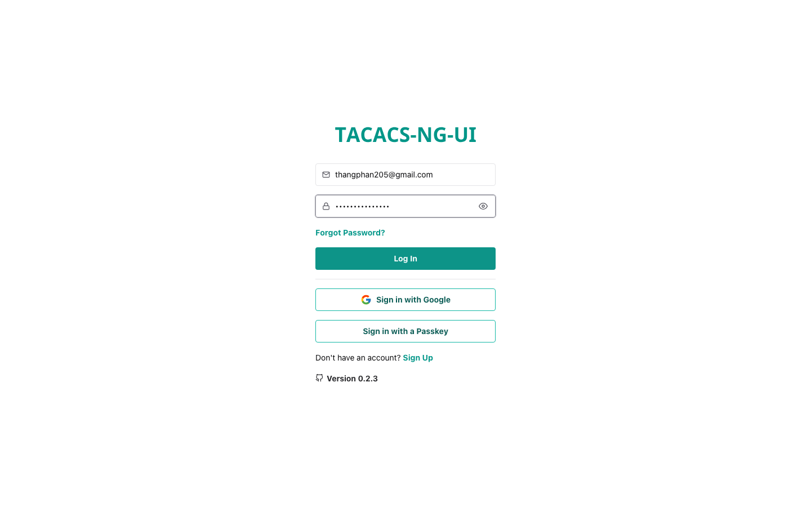

Login options:
- **Email + Password** — default method
- **Sign in with Google** — requires Google OAuth configured in `.env`
- **Sign in with Keycloak** — requires Keycloak OIDC configured
- **Passkeys** — passwordless login via WebAuthn (biometrics/hardware key)

Default admin credentials are set via `FIRST_SUPERUSER` and `FIRST_SUPERUSER_PASSWORD` in your `.env` file.

After login you land on the main dashboard:

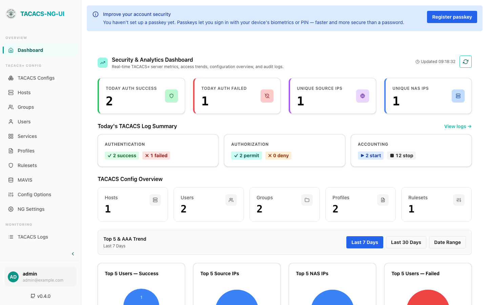

---

## Core Concepts

Understanding how tacacs-ng-ui maps to a TACACS+ config:

| Concept | What it does |
|---------|-------------|
| **TACACS User** | A network device user (the person logging into a router/switch) |
| **TACACS Group** | A group that users belong to; policies are applied to the group |
| **Host** | A network device (router, switch, firewall) that authenticates against the TACACS+ server |
| **Profile** | Defines what attributes (service, privilege level) are returned in an authorization response |
| **Ruleset** | Conditional access rules — permits or denies based on user/group/service/command |
| **TACACS Config** | The generated configuration file loaded by the `tac_plus-ng` daemon |
| **MAVIS** | An external authentication backend (e.g., LDAP/AD) used instead of local passwords |

> **Reminder:** After modifying any of the above, always regenerate and activate the config. See [Generating and Applying Config Files](#generating-and-applying-config-files).

---

## Step-by-Step: First-Time Setup

Follow this order when configuring from scratch:

### 1. Configure Server Settings

Go to **TACACS-NG Settings** and set:
- IPv4 address and port (default: `0.0.0.0`, port `49`)
- Log file paths for authentication, authorization, and accounting
- Authentication/user backends (`local`, `mavis`, `pap`, etc.)

### 2. Create TACACS Groups

Go to **TACACS Groups** → **Add Group**.
- Example groups: `network-admins`, `read-only-ops`

### 3. Create TACACS Users

Go to **TACACS Users** → **Add User**.
- Set `username`, `password`, `password_type` (`pap`), and assign to a group.

### 4. Create Profiles (Authorization Attributes)

Go to **Profiles** → **Add Profile**.
- Set `action` to `permit` or `deny`.
- Add **Profile Scripts** to return key-value pairs to devices (e.g., `service=exec`, `priv-lvl=15`).

### 5. Create Rulesets (Access Control)

Go to **Rulesets** → **Add Ruleset**.
- Define conditional rules that match users/groups/services and map them to profiles.
- Add **Ruleset Scripts** with conditions (e.g., `$user == "admin"`, `$nas == "192.168.1.1"`).

### 6. Add Network Devices (Hosts)

Go to **Hosts** → **Add Host**.
- Set the device IP address and `secret_key` (must match what is configured on the device).

### 7. Generate and Activate Config

> **⚠️ This step is required after EVERY configuration change.**

Go to **TACACS Configs** → **Generate Config** → mark the new config as **Active**.

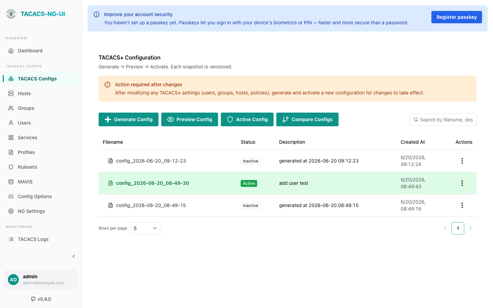

### 8. Configure Network Devices

Point your routers/switches at the TACACS+ server. See [device examples](#typical-device-side-configuration).

---

## Managing TACACS+ Users & Groups

### TACACS Groups

**Path:** Sidebar → TACACS Groups

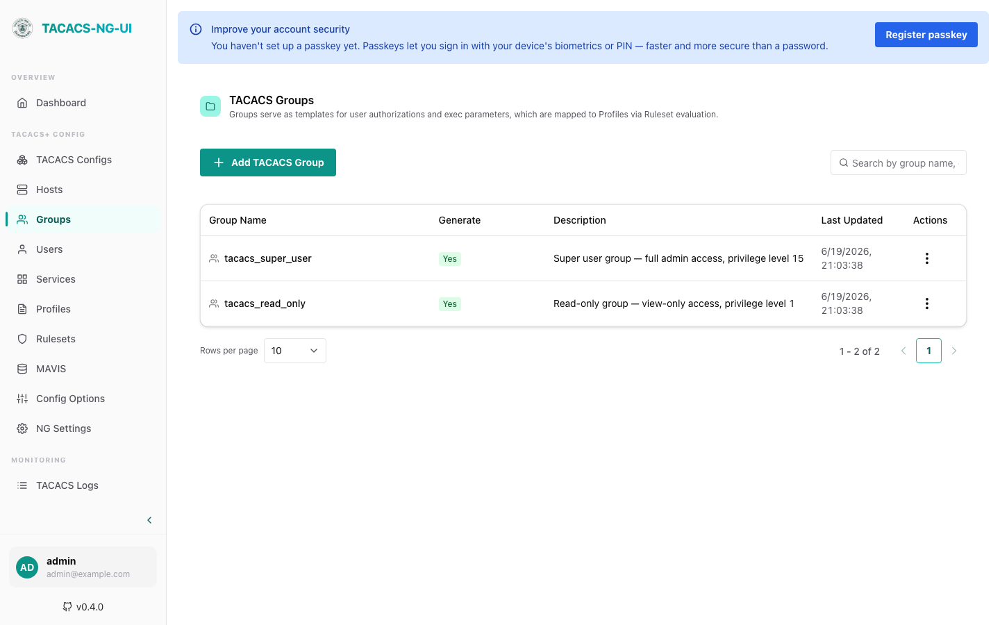

| Field | Description |
|-------|-------------|
| `group_name` | Unique name for the group (e.g., `network-admins`) |
| `description` | Optional description |

Groups are referenced in TACACS Users and Rulesets to apply policies to multiple users at once.

### TACACS Users

**Path:** Sidebar → TACACS Users

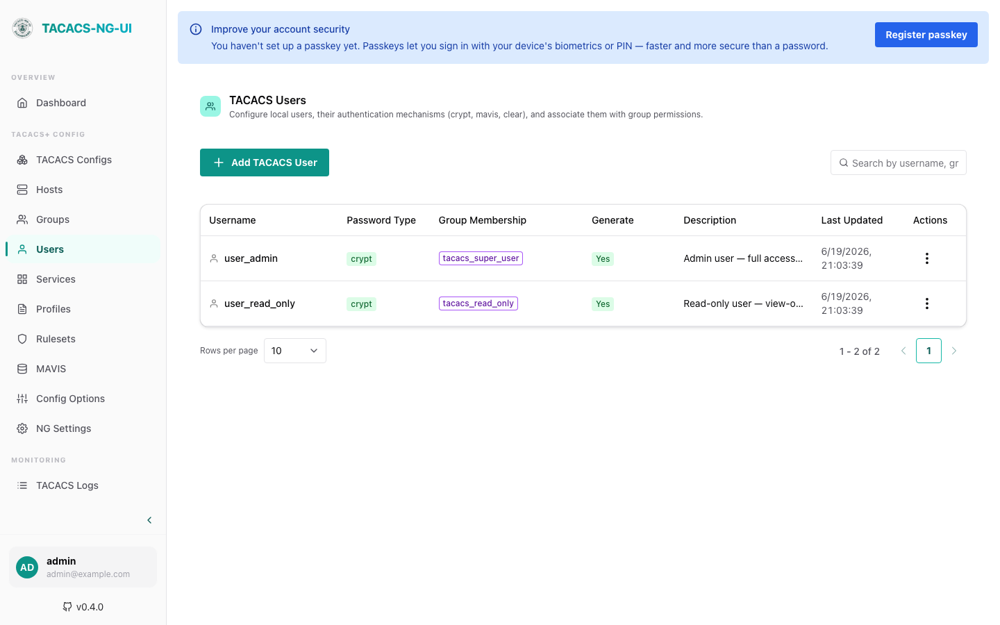

| Field | Description |
|-------|-------------|
| `username` | Login name used on network devices |
| `password` | User's password (stored hashed) |
| `password_type` | Protocol for password exchange — typically `pap` |
| `member` | Group this user belongs to |
| `description` | Optional description |

**Notes:**
- `password_type: pap` is the most common. Use `login` for ASCII auth.
- Users inherit policies from their group via Rulesets.

> **After adding/editing users:** regenerate and activate config.

---

## Configuring Network Devices (Hosts)

**Path:** Sidebar → Hosts

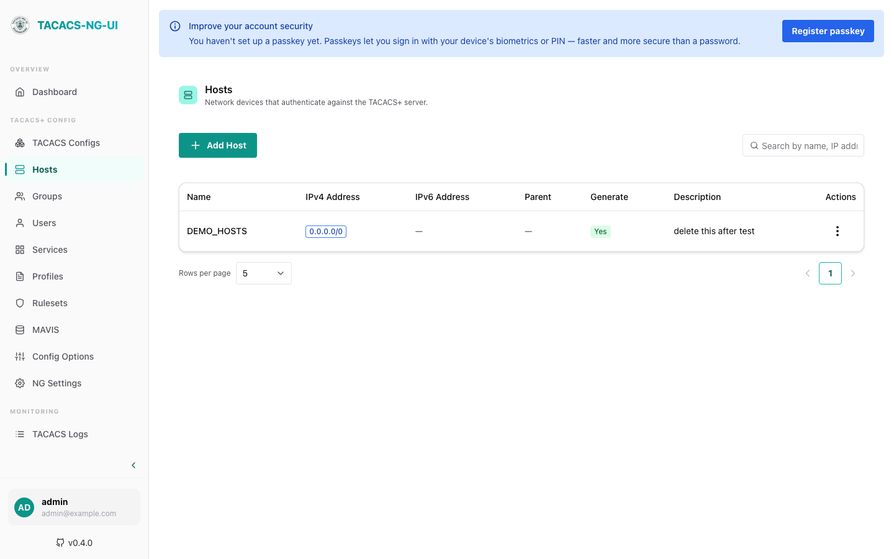

| Field | Description |
|-------|-------------|
| `name` | Identifier for the host (e.g., `core-switch-01`) |
| `ipv4_address` | Device IP address (used to match TACACS requests) |
| `ipv6_address` | Optional IPv6 address |
| `secret_key` | Shared secret — must match the device's TACACS key config |
| `parent` | Optional parent host for inheriting settings |
| `welcome_banner` | Message sent to the user on successful login |
| `reject_banner` | Message sent on denied access |
| `motd_banner` | Message of the day shown after login |
| `failed_authentication_banner` | Message sent on failed authentication |

> **After adding/editing hosts:** regenerate and activate config.

### Typical Device-Side Configuration

**Cisco IOS / IOS-XE:**
```bash
! 1. Enable AAA first (must be before tacacs server block)
aaa new-model

! 2. Define the TACACS+ server
tacacs server MY-TACACS
  address ipv4 <TACACS_SERVER_IP>
  key <secret_key>
  exit

! 3. Create a named server group (allows easy failover/redundancy)
aaa group server tacacs+ TACACS-GROUP
  server name MY-TACACS
  exit

! 4. Authentication, Authorization, Accounting
aaa authentication login default group TACACS-GROUP local
aaa authorization exec default group TACACS-GROUP local
aaa accounting exec default start-stop group TACACS-GROUP
aaa accounting commands 15 default start-stop group TACACS-GROUP

! 5. Apply to VTY lines (SSH/Telnet) — required or TACACS won't be used
line vty 0 4
  login authentication default
  exit
```

**Juniper JunOS:**
```bash
# 1. Define local user classes that TACACS users will be mapped to
set system login class tacacs-admin permissions all
set system login class tacacs-read permissions [ view view-configuration ]
set system login user user_demo uid 9999 class tacacs-admin

# 2. Configure TACACS+ server (source-address = management interface IP)
set system tacplus-server <TACACS_SERVER_IP> port 49 secret <secret_key>
set system tacplus-server <TACACS_SERVER_IP> source-address <DEVICE_MGMT_IP>

# 3. Set authentication order (TACACS first, local password fallback)
set system authentication-order tacplus
set system authentication-order password

# 4. Enable accounting
set system accounting events login
set system accounting events interactive-commands
set system accounting destination tacplus server <TACACS_SERVER_IP> secret <secret_key>
set system accounting destination tacplus server <TACACS_SERVER_IP> source-address <DEVICE_MGMT_IP>
```

**Arista EOS:**
```bash
# 1. Define TACACS+ server (key 7 = encrypted; key 0 = plaintext, avoid in production)
tacacs-server host <TACACS_SERVER_IP> key 7 <encrypted_secret_key>

# 2. Create a named server group
aaa group server tacacs+ TACACS-GROUP
   server <TACACS_SERVER_IP>
!

# 3. Authentication, Authorization, Accounting
aaa authentication login default group TACACS-GROUP local
aaa authorization exec default group TACACS-GROUP local
aaa authorization commands all default group TACACS-GROUP local
aaa accounting exec default start-stop group TACACS-GROUP

# 4. Source TACACS traffic from management interface
ip tacacs source-interface Management0
```

---

## Access Control: Profiles & Rulesets

### Profiles

**Path:** Sidebar → Profiles

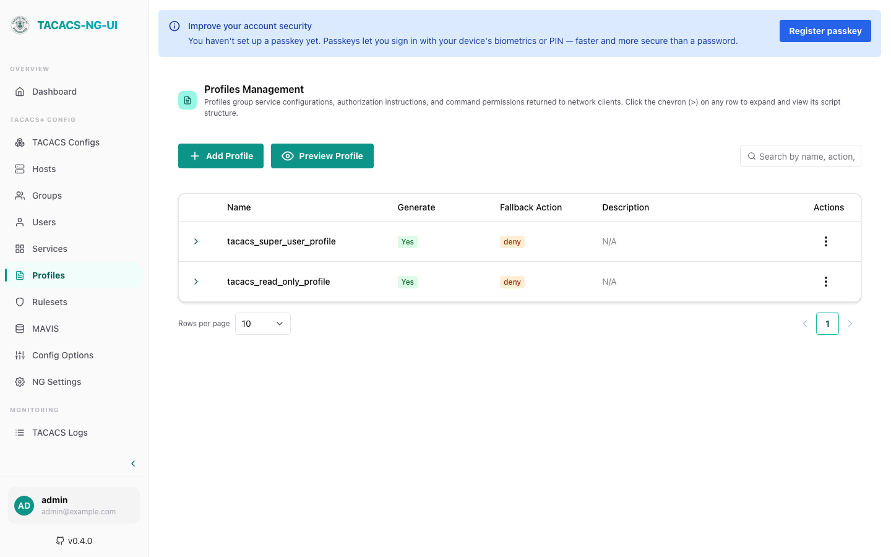

Profiles define the **authorization response** sent back to a device when access is granted.

| Field | Description |
|-------|-------------|
| `name` | Profile identifier |
| `action` | `permit` or `deny` |
| `description` | Optional description |

#### Profile Scripts

Add attribute-value pairs returned to the device in the authorization response.

**Path:** Profiles → select profile → Profile Scripts

| Field | Description |
|-------|-------------|
| `condition` | Optional condition expression (e.g., `$user == "admin"`) |
| `key` | Attribute name (e.g., `priv-lvl`, `service`) |
| `value` | Attribute value (e.g., `15`, `exec`) |
| `action` | `set`, `add`, or `optional` |

**Example — Grant full privilege to admins:**
```
key: service     value: exec
key: priv-lvl    value: 15
```

**Example — Read-only access:**
```
key: service     value: exec
key: priv-lvl    value: 1
```

#### Profile Script Sets

Sub-parameters for a profile script entry (used for service-level attributes like `cmd` authorization).

### Rulesets

**Path:** Sidebar → Rulesets

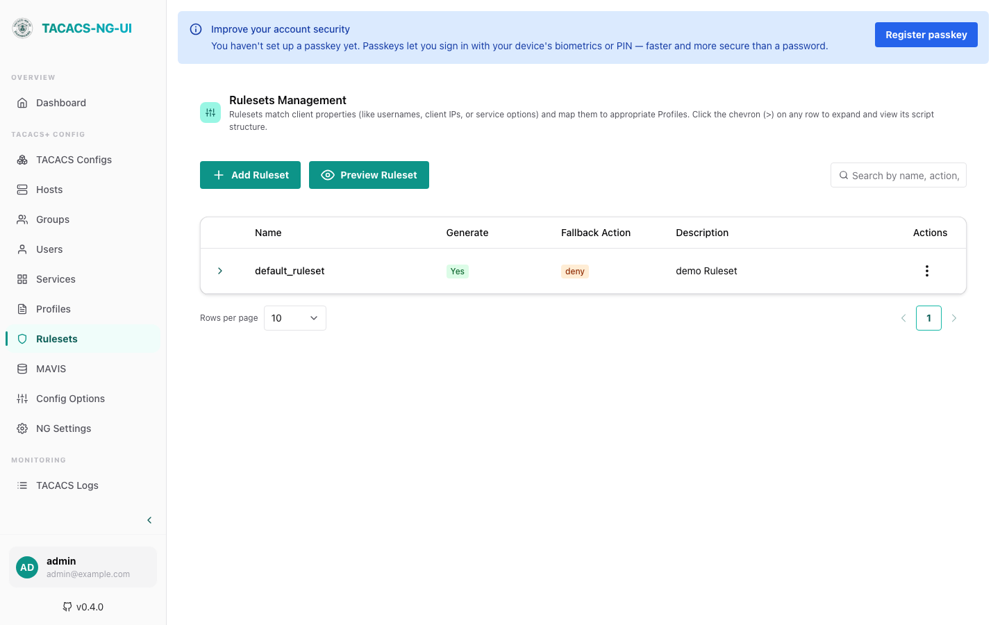

Rulesets define **which users get which profile** based on conditions.

| Field | Description |
|-------|-------------|
| `name` | Ruleset identifier |
| `enabled` | `yes` or `no` — toggle without deleting |
| `action` | Default action if no script matches: `permit` or `deny` |
| `description` | Optional description |

#### Ruleset Scripts

Add conditional rules within a ruleset.

**Path:** Rulesets → select ruleset → Ruleset Scripts

| Field | Description |
|-------|-------------|
| `condition` | Match expression (e.g., `$user == "admin"`, `$group == "network-admins"`) |
| `key` | Attribute to set in response |
| `value` | Attribute value |
| `action` | `permit`, `deny`, or `set` |

**Common condition variables:**
- `$user` — TACACS username
- `$group` — User's group
- `$nas` — NAS (device) IP address
- `$service` — Requested service (e.g., `shell`, `exec`)
- `$protocol` — Protocol (e.g., `telnet`, `ssh`)

**Example ruleset logic:**
```
condition: $group == "network-admins"   action: permit   key: priv-lvl   value: 15
condition: $group == "read-only"        action: permit   key: priv-lvl   value: 1
default action: deny
```

> **After adding/editing profiles or rulesets:** regenerate and activate config.

---

## Server Settings

**Path:** Sidebar → TACACS-NG Settings

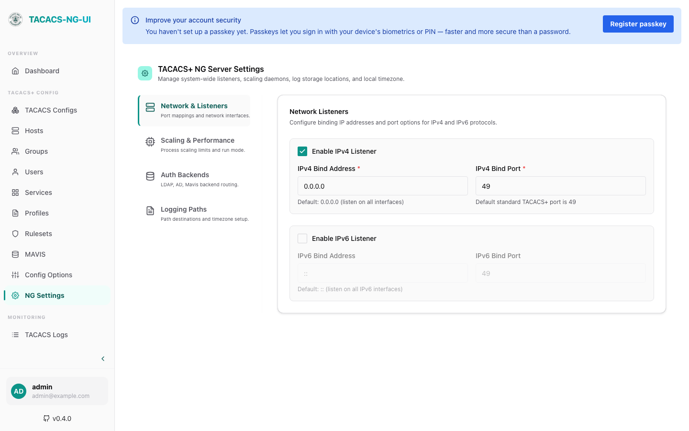

| Field | Description |
|-------|-------------|
| `ipv4_enabled` | Enable IPv4 listener |
| `ipv4_address` | Bind address (use `0.0.0.0` to listen on all interfaces) |
| `ipv4_port` | TACACS+ port (default: `49`) |
| `ipv6_enabled` | Enable IPv6 listener |
| `ipv6_address` | IPv6 bind address |
| `ipv6_port` | IPv6 TACACS+ port |
| `instances_min` | Minimum server process instances |
| `instances_max` | Maximum server process instances |
| `background` | Run server in background (`yes`/`no`) |
| `access_logfile_destination` | Path pattern for access logs (e.g., `/var/log/tacacs/%Y/%m/%d/access.log`) |
| `authentication_logfile_destination` | Path for authentication logs |
| `authorization_logfile_destination` | Path for authorization logs |
| `accounting_logfile_destination` | Path for accounting logs |
| `login_backend` | Backend for login auth (`local`, `mavis`) |
| `user_backend` | Backend for user lookups |
| `pap_backend` | Backend for PAP auth |

Log path patterns support `strftime` format — `%Y/%m/%d` creates daily log rotation.

> **After changing server settings:** regenerate and activate config.

---

## Generating and Applying Config Files

**Path:** Sidebar → TACACS Configs

> ### ⚠️ CRITICAL — MUST DO AFTER EVERY CHANGE
>
> Changes to users, groups, hosts, profiles, rulesets, MAVIS, or server settings have **no effect** on the live TACACS+ server until you regenerate and activate the config.

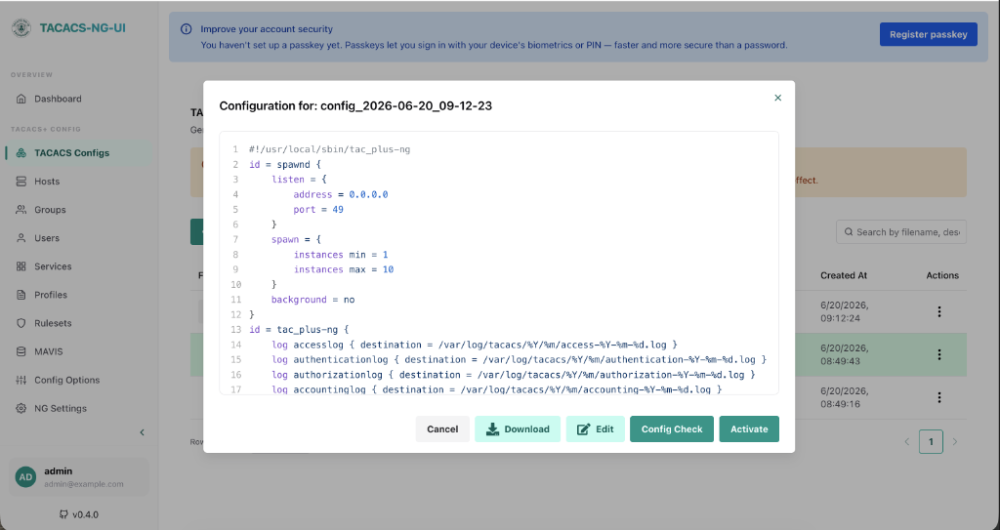

### Workflow: Generate → Preview → Activate

The page follows a three-step workflow. Each config snapshot is versioned and can be inspected before being promoted.

**Step 1 — Generate Config**

Click **Generate Config** to build a complete `tac_plus-ng` config from all current settings. A dialog asks for a filename and optional description; defaults are pre-filled with the current timestamp.

**Step 2 — Preview Config**

Click **Preview Config** to see what the next generated config would look like without saving it. Useful for reviewing changes before committing.

**Step 3 — Activate**

In the config table, open the Actions menu for any snapshot and select **Activate** to mark it as the live config. The active row is highlighted in green with an **Active** badge.

**Active Config button**

Click **Active Config** to view the currently running configuration file in a syntax-highlighted modal.


### Config Table

| Column | Description |
|--------|-------------|
| Filename | Config snapshot name — click to view file contents |
| Status | Active (green) or Inactive (gray) |
| Description | Optional description set at generation time |
| Created At | Date and time the snapshot was generated |
| Actions | Activate / Delete |

### Config Reload

After activating, the `tac_plus-ng` daemon picks up the changes. In Docker deployments, the config file is written to the `/app/tacacs_config/` volume shared with the TACACS+ server container.

### Viewing TACACS Logs

**Path:** Sidebar → TACACS Logs

View TACACS+ log events. Use the **Events** tab for a structured, filterable view (see [TACACS Log Events Viewer](#tacacs-log-events-viewer)).

---

## Dashboard Overview

**Path:** Sidebar → Dashboard

The dashboard provides a real-time summary of your TACACS+ environment across four sections.

### Today's Log Summary

Three stat cards pulled directly from live TACACS+ log files:

| Card | Metrics |
|------|---------|
| **Authentication** | ✓ Successful logins / ✗ Failed logins today |
| **Authorization** | ✓ Permit decisions / ✗ Deny decisions today |
| **Accounting** | ▶ Session starts / ■ Session stops today |

Click any card to jump to the TACACS Log Events viewer for detailed records.

### Config Overview

Five clickable count cards showing current entity totals:

| Card | Navigates to |
|------|-------------|
| Hosts | `/hosts` |
| TACACS Users | `/tacacs_users` |
| TACACS Groups | `/tacacs_groups` |
| Profiles | `/profiles` |
| Rulesets | `/rulesets` |

### Recent User Activity

Compact table of the last 10 audit log entries — shows Time, Dashboard User, Action (color-coded badge), Entity type, and Description. Click **View all →** to open the full Audit Logs page.

### Top 5 & AAA Trend

Four pie charts (Top 5 Source IPs, Top 5 NAS IPs, Top 5 Auth Users, Top 5 Authz Users) and a six-series trend line chart (auth success/fail, authz permit/deny, acct start/stop).

**Filter bar** (above the charts):

| Option | Period |
|--------|--------|
| Last 7 Days | Rolling 7-day window ending today |
| Last 30 Days | Rolling 30-day window ending today |
| Date Range | Custom start and end date inputs |

Default is **Last 7 Days**. All options query the database statistics endpoint; data is updated nightly by the statistics batch job.

---

## TACACS Log Events Viewer

**Path:** Sidebar → TACACS Logs → Events tab

Browse and search structured TACACS+ log events parsed from raw log files.

### Filters

| Filter | Options |
|--------|---------|
| Date | Date picker (defaults to today) |
| Type | All / Authentication / Authorization / Accounting |
| Result | All / Success / Failed / Permit / Deny / Start / Stop |
| Username | Free-text search |

### Event Table Columns

| Column | Description |
|--------|-------------|
| Timestamp | Date and time of the event |
| Type | Authentication / Authorization / Accounting (color badge) |
| Result | Success / Failed / Permit / Deny / Start / Stop (color badge) |
| Username | TACACS username |
| NAS IP | Network device IP address |
| Message | Raw log message |

Results are paginated. Use the date picker and filters to narrow down to specific events.

---

## SIEM Integration

tacacs-ng-ui can forward TACACS+ log events in real-time to external security platforms.

### Configuration (`.env`)

```bash
# Enable SIEM forwarding
SIEM_FORWARD_TACACS_EVENTS=true

# HTTP Webhook (Splunk HEC format)
SIEM_WEBHOOK_URL=https://splunk.example.com:8088/services/collector/event
SIEM_WEBHOOK_TOKEN=your-hec-token

# Syslog (UDP or TCP)
SIEM_SYSLOG_HOST=syslog.example.com
SIEM_SYSLOG_PORT=514
SIEM_SYSLOG_PROTOCOL=udp   # or tcp
```

### Webhook Payload (Splunk HEC format)

```json
{
  "time": 1714012800,
  "event": {
    "timestamp": "2026-04-25T10:30:00Z",
    "type": "authentication",
    "result": "success",
    "username": "admin",
    "nas_ip": "192.168.1.1",
    "message": "..."
  }
}
```

Events are forwarded asynchronously — TACACS+ authentication is not blocked if the SIEM endpoint is unavailable.

### Supported Integrations

| Platform | Method |
|----------|--------|
| Splunk | HTTP Event Collector (HEC) webhook |
| Elastic / Logstash | HTTP webhook or syslog input |
| Graylog | GELF HTTP or syslog UDP/TCP |
| Any syslog receiver | UDP or TCP syslog |

---

## Monitoring & Statistics

### AAA Statistics (Today)

**Path:** Sidebar → AAA Statistics

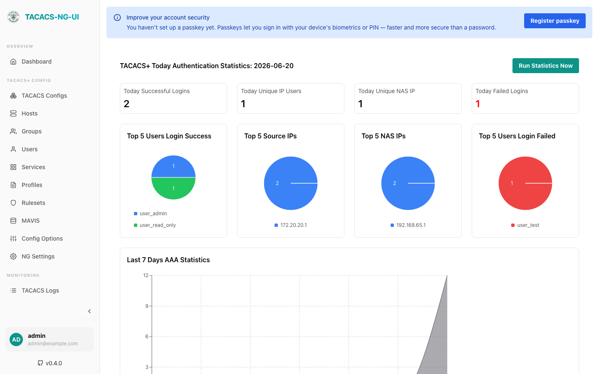

Shows today's totals:
- Authentication success/failure counts
- Authorization permit/deny counts
- Accounting start/stop events
- 7-day trend charts

### AAA Statistics Range

**Path:** Sidebar → AAA Statistics Range

Select a custom date range to view aggregated statistics.

### Authentication Statistics

**Path:** Sidebar → Authentication Statistics


Per-user, per-device breakdown of authentication events (success/failure counts).

### Authorization Statistics

**Path:** Sidebar → Authorization Statistics


Per-user breakdown of authorization decisions (permit/deny counts).

### Accounting Statistics

**Path:** Sidebar → Accounting Statistics


Per-user session accounting (start/stop event counts).

### TACACS Statistics

**Path:** Sidebar → TACACS Statistics

Server-wide performance and request statistics.

---

## Audit Logs

**Path:** Sidebar → Audit Logs

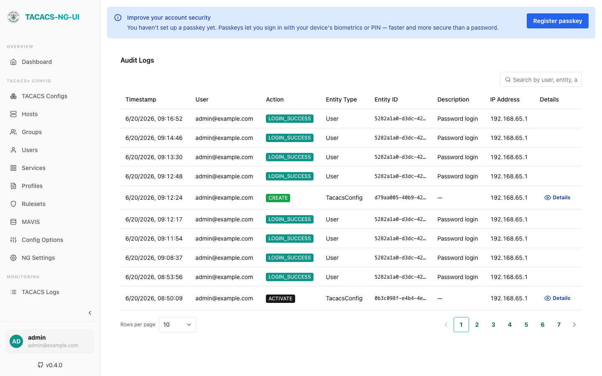

Every configuration change made through the UI is recorded:

| Field | Description |
|-------|-------------|
| `action` | `create`, `update`, `delete` |
| `entity_type` | What was changed (e.g., `TacacsUser`, `Host`) |
| `entity_id` | UUID of the changed record |
| `user_email` | Dashboard user who made the change |
| `ip_address` | IP address of the user's browser |
| `old_values` | Snapshot before the change |
| `new_values` | Snapshot after the change |
| `timestamp` | When the change occurred |

Use audit logs to track who changed what and when — essential for compliance and troubleshooting.

---

## Application User Management

These are users who log into the **dashboard** (not TACACS device users).

**Path:** Sidebar → Admin → Users Management (superuser only)

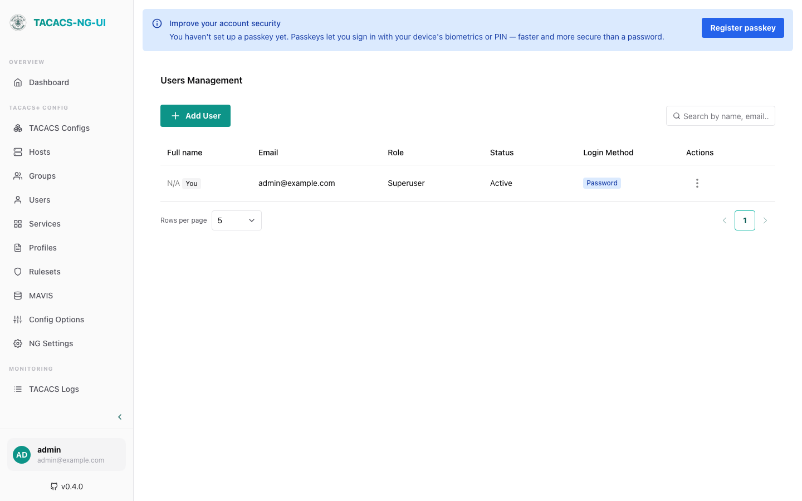

| Field | Description |
|-------|-------------|
| `email` | Login email |
| `full_name` | Display name |
| `is_active` | Activate or deactivate the account |
| `is_superuser` | Grant full admin access |
| `password_login_disabled` | Force OAuth/Passkey login only (disable password) |

### Auth Providers

**Path:** Sidebar → Admin → Auth Providers

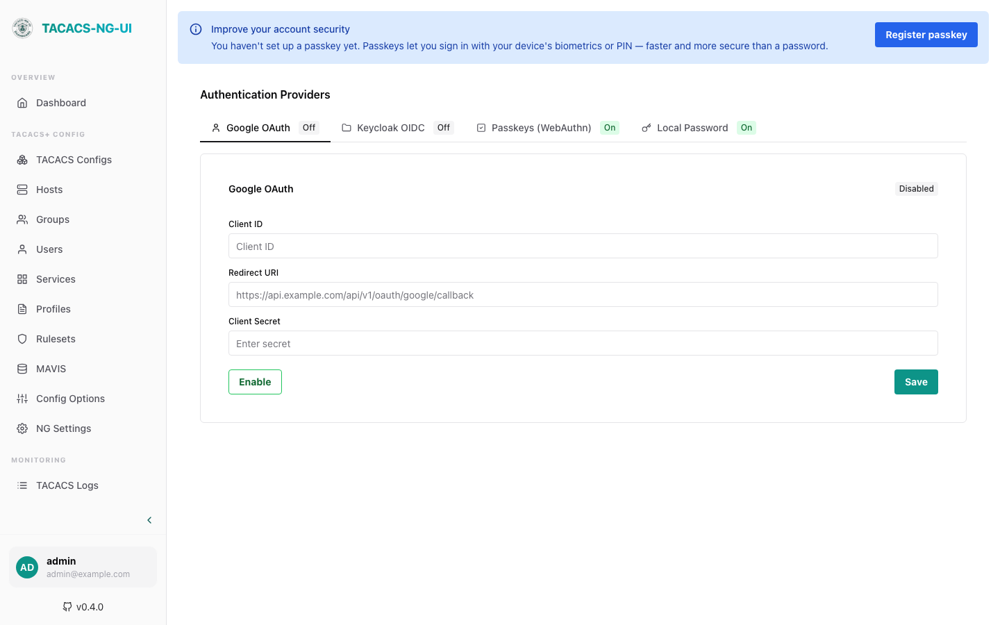

Configure which authentication methods are enabled for the dashboard:

| Provider | Configuration |
|----------|--------------|
| `google` | Requires `GOOGLE_CLIENT_ID`, `GOOGLE_CLIENT_SECRET`, `GOOGLE_REDIRECT_URI` in `.env` |
| `keycloak` | Requires Keycloak server URL, client ID, and client secret |
| `passkeys` | WebAuthn — no extra config required; users register passkeys from their profile settings |

### Password Recovery

Users can request a password reset email from the login page. Requires SMTP configured in `.env` (`SMTP_HOST`, `SMTP_USER`, `SMTP_PASSWORD`, `EMAILS_FROM_EMAIL`).

### User Account Settings

**Path:** Sidebar → Settings

Each user can:
- Update their name and email
- Change their password
- Register or remove passkeys

---

## Advanced: MAVIS Backends

**Path:** Sidebar → Mavises

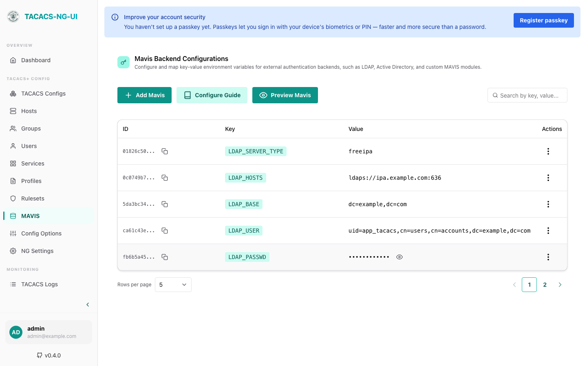

MAVIS (Modular AAA Via Integrated Scripts) allows `tac_plus-ng` to delegate authentication to external systems (LDAP, Active Directory, etc.).

| Field | Description |
|-------|-------------|
| `mavis_key` | MAVIS configuration directive |
| `mavis_value` | Value for the directive |

Use **Preview** to see the MAVIS config block that will be generated.

Typical use case: authenticate TACACS users against Active Directory via LDAP MAVIS module instead of local passwords.

> **After changing MAVIS settings:** regenerate and activate config.

---

## Advanced: Custom Configuration Options

**Path:** Sidebar → Configuration Options

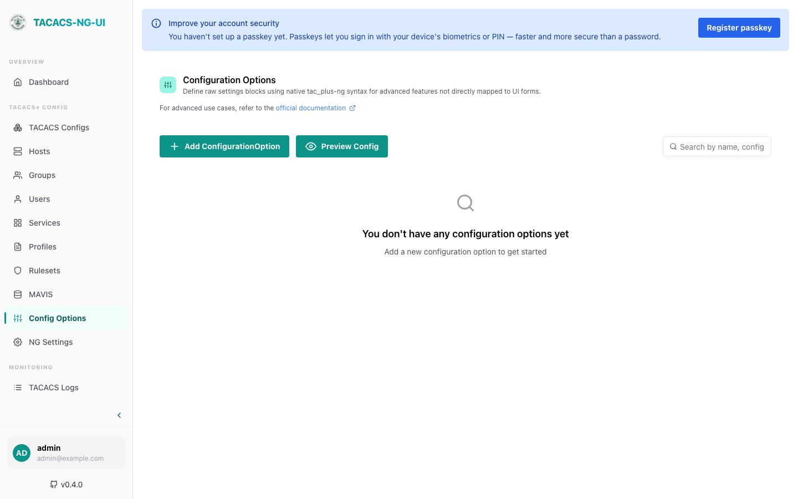

Inject raw `tac_plus-ng` configuration blocks that are not covered by the UI fields.

| Field | Description |
|-------|-------------|
| `name` | Label for this config block |
| `config_option` | Raw configuration text (appended to generated config) |
| `description` | Optional description |

Use this for advanced directives like custom ACLs, time-based access controls, or any `tac_plus-ng` feature not exposed in the UI.

> **After adding custom options:** regenerate and activate config.

---

## Troubleshooting

| Symptom | Check |
|---------|-------|
| Device cannot authenticate | Verify `secret_key` matches on both Host and device config; verify config was regenerated and activated |
| Changes not taking effect | **Regenerate and activate config** — this is the most common cause |
| Authentication succeeds but no exec shell | Ensure profile returns `service=exec` and `priv-lvl` attribute |
| User not in group policy | Confirm user's `member` field matches exact group name |
| No logs appearing | Check `accounting_logfile_destination` path and directory permissions |
| 401/403 on dashboard | Token expired — log out and back in |
| Config syntax error | Check TACACS Logs for `tac_plus-ng` error output |

---

## Quick Reference: Typical Workflow

```
1. Server Settings        → set IP, port, log paths
2. TACACS Groups          → create groups (e.g., admins, read-only)
3. TACACS Users           → create users, assign to groups
4. Profiles               → define auth response (priv-lvl, service)
5. Profile Scripts        → add key-value attributes to profile
6. Rulesets               → map users/groups to profiles via conditions
7. Hosts                  → add devices with IP and secret key
8. ⚠️  TACACS Configs     → GENERATE CONFIG → mark ACTIVE  ← REQUIRED AFTER EVERY CHANGE
9. Device Config          → configure device to point at TACACS+ server
10. Monitor               → use Statistics and Logs to verify operation
```

---

## Useful Links

- TACACS+ Server: [tac_plus-ng](https://github.com/MarcJHuber/event-driven-servers)
- API Docs: `http://<your-host>:8000/docs` (also see screenshot below)
- Deployment Guide: [deployment.md](./deployment.md)
- Development Guide: [development.md](./development.md)
- Release Notes: [release-notes.md](./release-notes.md)
- Community: [Telegram](https://t.me/+v1eAXg-BhotlODY1) | [Reddit](https://www.reddit.com/r/tacacs_ng_ui/)

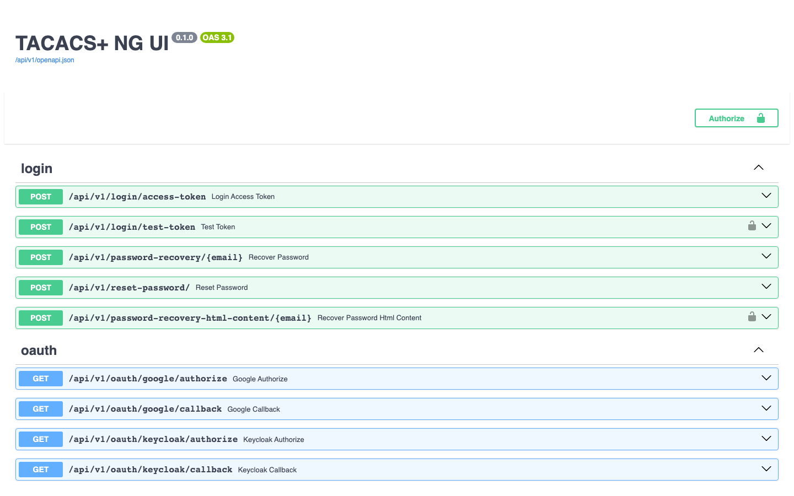

---

---

# Hướng Dẫn Sử Dụng tacacs-ng-ui

> **🌐 Song ngữ — English version starts at the [top](#tacacs-ng-ui-user-guide).**

---

> ### ⚠️ QUAN TRỌNG — ĐỌC TRƯỚC
>
> **Bất cứ khi nào bạn thay đổi cấu hình TACACS (người dùng, nhóm, thiết bị, profile, ruleset, cài đặt), bạn PHẢI vào TACACS Configs → Generate Config → đánh dấu config mới là Active.**
>
> Các thay đổi sẽ KHÔNG có hiệu lực trên TACACS+ server cho đến khi config được tạo lại và kích hoạt.

---

## Mục Lục

1. [Bắt Đầu](#bắt-đầu)
2. [Khái Niệm Cơ Bản](#khái-niệm-cơ-bản)
3. [Thiết Lập Lần Đầu](#thiết-lập-lần-đầu)
4. [Quản Lý Người Dùng & Nhóm TACACS+](#quản-lý-người-dùng--nhóm-tacacs)
5. [Cấu Hình Thiết Bị Mạng (Hosts)](#cấu-hình-thiết-bị-mạng-hosts)
6. [Kiểm Soát Truy Cập: Profiles & Rulesets](#kiểm-soát-truy-cập-profiles--rulesets)
7. [Cài Đặt Server](#cài-đặt-server)
8. [Tạo và Kích Hoạt File Config](#tạo-và-kích-hoạt-file-config)
9. [Tổng Quan Dashboard](#tổng-quan-dashboard)
10. [Xem Sự Kiện Log TACACS](#xem-sự-kiện-log-tacacs)
11. [Tích Hợp SIEM](#tích-hợp-siem)
12. [Giám Sát & Thống Kê](#giám-sát--thống-kê)
13. [Nhật Ký Kiểm Tra (Audit Logs)](#nhật-ký-kiểm-tra-audit-logs)
14. [Quản Lý Người Dùng Ứng Dụng](#quản-lý-người-dùng-ứng-dụng)
15. [Nâng Cao: MAVIS Backend](#nâng-cao-mavis-backend)
16. [Nâng Cao: Tùy Chọn Cấu Hình Tùy Chỉnh](#nâng-cao-tùy-chọn-cấu-hình-tùy-chỉnh)
17. [Xử Lý Sự Cố](#xử-lý-sự-cố)

---

## Bắt Đầu

### Đăng Nhập

Truy cập URL dashboard của bạn (ví dụ: `http://localhost:5173` hoặc domain đã cấu hình).


Các phương thức đăng nhập:
- **Email + Mật khẩu** — phương thức mặc định
- **Đăng nhập với Google** — yêu cầu cấu hình Google OAuth trong `.env`
- **Đăng nhập với Keycloak** — yêu cầu cấu hình Keycloak OIDC
- **Passkeys** — đăng nhập không mật khẩu qua WebAuthn (sinh trắc học/hardware key)

Thông tin đăng nhập admin mặc định được cấu hình qua `FIRST_SUPERUSER` và `FIRST_SUPERUSER_PASSWORD` trong file `.env`.

---

## Khái Niệm Cơ Bản

Hiểu cách tacacs-ng-ui ánh xạ tới cấu hình TACACS+:

| Khái niệm | Chức năng |
|-----------|-----------|
| **TACACS User** | Người dùng thiết bị mạng (người đăng nhập vào router/switch) |
| **TACACS Group** | Nhóm mà người dùng thuộc về; chính sách được áp dụng theo nhóm |
| **Host** | Thiết bị mạng (router, switch, firewall) xác thực với TACACS+ server |
| **Profile** | Định nghĩa các thuộc tính (service, privilege level) trả về trong phản hồi authorization |
| **Ruleset** | Quy tắc truy cập có điều kiện — cho phép hoặc từ chối dựa trên user/group/service/command |
| **TACACS Config** | File cấu hình được tạo ra và nạp vào daemon `tac_plus-ng` |
| **MAVIS** | Backend xác thực bên ngoài (ví dụ: LDAP/AD) thay cho mật khẩu cục bộ |

> **Nhắc nhở:** Sau khi chỉnh sửa bất kỳ mục nào ở trên, luôn phải tạo lại và kích hoạt config. Xem [Tạo và Kích Hoạt File Config](#tạo-và-kích-hoạt-file-config).

---

## Thiết Lập Lần Đầu

Thực hiện theo thứ tự này khi cấu hình từ đầu:

### 1. Cấu Hình Cài Đặt Server

Vào **TACACS-NG Settings** và thiết lập:
- Địa chỉ IPv4 và cổng (mặc định: `0.0.0.0`, cổng `49`)
- Đường dẫn file log cho authentication, authorization và accounting
- Backend xác thực (`local`, `mavis`, `pap`, v.v.)

### 2. Tạo Nhóm TACACS

Vào **TACACS Groups** → **Add Group**.
- Ví dụ nhóm: `network-admins`, `read-only-ops`

### 3. Tạo Người Dùng TACACS

Vào **TACACS Users** → **Add User**.
- Thiết lập `username`, `password`, `password_type` (`pap`), và gán vào nhóm.

### 4. Tạo Profiles (Thuộc Tính Authorization)

Vào **Profiles** → **Add Profile**.
- Đặt `action` là `permit` hoặc `deny`.
- Thêm **Profile Scripts** để trả về các cặp key-value cho thiết bị (ví dụ: `service=exec`, `priv-lvl=15`).

### 5. Tạo Rulesets (Kiểm Soát Truy Cập)

Vào **Rulesets** → **Add Ruleset**.
- Định nghĩa các quy tắc có điều kiện khớp với user/group/service và ánh xạ tới profiles.
- Thêm **Ruleset Scripts** với các điều kiện (ví dụ: `$user == "admin"`, `$nas == "192.168.1.1"`).

### 6. Thêm Thiết Bị Mạng (Hosts)

Vào **Hosts** → **Add Host**.
- Đặt địa chỉ IP thiết bị và `secret_key` (phải khớp với cấu hình trên thiết bị).

### 7. Tạo và Kích Hoạt Config

> **⚠️ Bước này bắt buộc sau MỖI lần thay đổi cấu hình.**

Vào **TACACS Configs** → **Generate Config** → đánh dấu config mới là **Active**.


### 8. Cấu Hình Thiết Bị Mạng

Trỏ các router/switch tới TACACS+ server. Xem [ví dụ cấu hình thiết bị](#cấu-hình-phía-thiết-bị).

---

## Quản Lý Người Dùng & Nhóm TACACS+

### Nhóm TACACS

**Đường dẫn:** Sidebar → TACACS Groups


| Trường | Mô tả |
|--------|-------|
| `group_name` | Tên duy nhất của nhóm (ví dụ: `network-admins`) |
| `description` | Mô tả tùy chọn |

Nhóm được tham chiếu trong TACACS Users và Rulesets để áp dụng chính sách cho nhiều người dùng cùng lúc.

### Người Dùng TACACS

**Đường dẫn:** Sidebar → TACACS Users


| Trường | Mô tả |
|--------|-------|
| `username` | Tên đăng nhập dùng trên thiết bị mạng |
| `password` | Mật khẩu người dùng (lưu dưới dạng hash) |
| `password_type` | Giao thức trao đổi mật khẩu — thường dùng `pap` |
| `member` | Nhóm mà người dùng này thuộc về |
| `description` | Mô tả tùy chọn |

**Lưu ý:**
- `password_type: pap` là phổ biến nhất. Dùng `login` cho ASCII auth.
- Người dùng kế thừa chính sách từ nhóm của họ qua Rulesets.

> **Sau khi thêm/sửa người dùng:** tạo lại và kích hoạt config.

---

## Cấu Hình Thiết Bị Mạng (Hosts)

**Đường dẫn:** Sidebar → Hosts


| Trường | Mô tả |
|--------|-------|
| `name` | Định danh thiết bị (ví dụ: `core-switch-01`) |
| `ipv4_address` | Địa chỉ IP thiết bị (dùng để khớp với TACACS request) |
| `ipv6_address` | Địa chỉ IPv6 tùy chọn |
| `secret_key` | Khóa bí mật dùng chung — phải khớp với cấu hình TACACS key trên thiết bị |
| `parent` | Host cha tùy chọn để kế thừa cài đặt |
| `welcome_banner` | Thông báo gửi tới người dùng khi đăng nhập thành công |
| `reject_banner` | Thông báo gửi khi bị từ chối truy cập |
| `motd_banner` | Thông báo ngày (Message of the Day) hiển thị sau đăng nhập |
| `failed_authentication_banner` | Thông báo gửi khi xác thực thất bại |

> **Sau khi thêm/sửa host:** tạo lại và kích hoạt config.

### Cấu Hình Phía Thiết Bị

**Cisco IOS / IOS-XE:**
```bash
! 1. Bật AAA trước (phải đặt trước khối tacacs server)
aaa new-model

! 2. Định nghĩa TACACS+ server
tacacs server MY-TACACS
  address ipv4 <TACACS_SERVER_IP>
  key <secret_key>
  exit

! 3. Tạo nhóm server có tên (giúp dễ dàng thêm server dự phòng)
aaa group server tacacs+ TACACS-GROUP
  server name MY-TACACS
  exit

! 4. Xác thực, Phân quyền, Ghi nhật ký
aaa authentication login default group TACACS-GROUP local
aaa authorization exec default group TACACS-GROUP local
aaa accounting exec default start-stop group TACACS-GROUP
aaa accounting commands 15 default start-stop group TACACS-GROUP

! 5. Áp dụng cho VTY lines (SSH/Telnet) — bắt buộc, nếu không TACACS sẽ không được dùng
line vty 0 4
  login authentication default
  exit
```

**Juniper JunOS:**
```bash
# 1. Định nghĩa class người dùng cục bộ mà TACACS users sẽ được ánh xạ vào
set system login class tacacs-admin permissions all
set system login class tacacs-read permissions [ view view-configuration ]
set system login user user_demo uid 9999 class tacacs-admin

# 2. Cấu hình TACACS+ server (source-address = IP interface quản lý)
set system tacplus-server <TACACS_SERVER_IP> port 49 secret <secret_key>
set system tacplus-server <TACACS_SERVER_IP> source-address <DEVICE_MGMT_IP>

# 3. Thứ tự xác thực (TACACS trước, fallback về local password)
set system authentication-order tacplus
set system authentication-order password

# 4. Bật accounting
set system accounting events login
set system accounting events interactive-commands
set system accounting destination tacplus server <TACACS_SERVER_IP> secret <secret_key>
set system accounting destination tacplus server <TACACS_SERVER_IP> source-address <DEVICE_MGMT_IP>
```

**Arista EOS:**
```bash
# 1. Định nghĩa TACACS+ server (key 7 = mã hóa; key 0 = plaintext, tránh dùng trong production)
tacacs-server host <TACACS_SERVER_IP> key 7 <encrypted_secret_key>

# 2. Tạo nhóm server có tên
aaa group server tacacs+ TACACS-GROUP
   server <TACACS_SERVER_IP>
!

# 3. Xác thực, Phân quyền, Ghi nhật ký
aaa authentication login default group TACACS-GROUP local
aaa authorization exec default group TACACS-GROUP local
aaa authorization commands all default group TACACS-GROUP local
aaa accounting exec default start-stop group TACACS-GROUP

# 4. Nguồn traffic TACACS từ interface quản lý
ip tacacs source-interface Management0
```

---

## Kiểm Soát Truy Cập: Profiles & Rulesets

### Profiles

**Đường dẫn:** Sidebar → Profiles


Profiles định nghĩa **phản hồi authorization** gửi lại cho thiết bị khi truy cập được cấp phép.

| Trường | Mô tả |
|--------|-------|
| `name` | Định danh profile |
| `action` | `permit` hoặc `deny` |
| `description` | Mô tả tùy chọn |

#### Profile Scripts

Thêm các cặp thuộc tính-giá trị trả về cho thiết bị trong phản hồi authorization.

**Đường dẫn:** Profiles → chọn profile → Profile Scripts

| Trường | Mô tả |
|--------|-------|
| `condition` | Biểu thức điều kiện tùy chọn (ví dụ: `$user == "admin"`) |
| `key` | Tên thuộc tính (ví dụ: `priv-lvl`, `service`) |
| `value` | Giá trị thuộc tính (ví dụ: `15`, `exec`) |
| `action` | `set`, `add`, hoặc `optional` |

**Ví dụ — Cấp quyền đầy đủ cho admin:**
```
key: service     value: exec
key: priv-lvl    value: 15
```

**Ví dụ — Quyền chỉ đọc:**
```
key: service     value: exec
key: priv-lvl    value: 1
```

### Rulesets

**Đường dẫn:** Sidebar → Rulesets


Rulesets định nghĩa **người dùng nào được profile nào** dựa trên điều kiện.

| Trường | Mô tả |
|--------|-------|
| `name` | Định danh ruleset |
| `enabled` | `yes` hoặc `no` — bật/tắt mà không cần xóa |
| `action` | Hành động mặc định nếu không có script nào khớp: `permit` hoặc `deny` |
| `description` | Mô tả tùy chọn |

#### Ruleset Scripts

Thêm quy tắc có điều kiện trong ruleset.

**Biến điều kiện thường dùng:**
- `$user` — Tên người dùng TACACS
- `$group` — Nhóm của người dùng
- `$nas` — Địa chỉ IP của thiết bị mạng (NAS)
- `$service` — Dịch vụ yêu cầu (ví dụ: `shell`, `exec`)
- `$protocol` — Giao thức (ví dụ: `telnet`, `ssh`)

**Ví dụ logic ruleset:**
```
condition: $group == "network-admins"   action: permit   key: priv-lvl   value: 15
condition: $group == "read-only"        action: permit   key: priv-lvl   value: 1
default action: deny
```

> **Sau khi thêm/sửa profiles hoặc rulesets:** tạo lại và kích hoạt config.

---

## Cài Đặt Server

**Đường dẫn:** Sidebar → TACACS-NG Settings


| Trường | Mô tả |
|--------|-------|
| `ipv4_enabled` | Bật listener IPv4 |
| `ipv4_address` | Địa chỉ bind (dùng `0.0.0.0` để lắng nghe trên tất cả interface) |
| `ipv4_port` | Cổng TACACS+ (mặc định: `49`) |
| `ipv6_enabled` | Bật listener IPv6 |
| `instances_min` / `instances_max` | Số tiến trình server tối thiểu/tối đa |
| `background` | Chạy server ở nền (`yes`/`no`) |
| `*_logfile_destination` | Đường dẫn file log (hỗ trợ `%Y/%m/%d` để phân chia theo ngày) |
| `login_backend` | Backend xác thực đăng nhập (`local`, `mavis`) |
| `pap_backend` | Backend cho PAP auth |

> **Sau khi thay đổi cài đặt server:** tạo lại và kích hoạt config.

---

## Tạo và Kích Hoạt File Config

**Đường dẫn:** Sidebar → TACACS Configs

> ### ⚠️ BẮT BUỘC SAU MỖI THAY ĐỔI
>
> Các thay đổi đối với users, groups, hosts, profiles, rulesets, MAVIS, hoặc cài đặt server sẽ **không có hiệu lực** trên TACACS+ server cho đến khi bạn tạo lại và kích hoạt config.

### Quy trình: Generate → Preview → Activate

**Bước 1 — Generate Config**: Nhấn **Generate Config** để tạo config `tac_plus-ng` đầy đủ từ tất cả cài đặt hiện tại. Hộp thoại sẽ hỏi tên file và mô tả; mặc định điền sẵn theo thời gian hiện tại.

**Bước 2 — Preview Config**: Nhấn **Preview Config** để xem trước nội dung config mà không lưu lại. Hữu ích để kiểm tra thay đổi trước khi xác nhận.

**Bước 3 — Activate**: Trong bảng danh sách config, mở menu Actions của snapshot cần dùng và chọn **Activate**. Hàng đang active được tô nền xanh với badge **Active**.

**Nút Active Config**: Nhấn để xem file config đang chạy với syntax highlighting.


Sau khi kích hoạt, daemon `tac_plus-ng` nhận cấu hình mới. Trong triển khai Docker, file config được ghi vào volume `/app/tacacs_config/` dùng chung với container TACACS+ server.

---

## Tổng Quan Dashboard

**Đường dẫn:** Sidebar → Dashboard

Dashboard cung cấp thông tin tổng hợp về môi trường TACACS+ qua bốn phần.

**Tóm Tắt Log Hôm Nay**: Ba thẻ thống kê lấy trực tiếp từ file log TACACS+: Authentication (thành công/thất bại), Authorization (cho phép/từ chối), Accounting (bắt đầu/kết thúc). Nhấn vào thẻ để chuyển đến trang Log Events.

**Tổng Quan Config**: Năm thẻ hiển thị số lượng thực thể hiện tại — Hosts, TACACS Users, TACACS Groups, Profiles, Rulesets. Nhấn để điều hướng đến trang tương ứng.

**Hoạt Động Người Dùng Gần Đây**: Bảng 10 bản ghi audit log gần nhất. Nhấn **Xem tất cả →** để mở trang Audit Logs.

**Top 5 & Xu Hướng AAA**: Bốn biểu đồ tròn (Top 5 Source IPs, NAS IPs, Auth Users, Authz Users) và biểu đồ xu hướng đường thẳng 6 series. Bộ lọc: **7 Ngày Qua** / **30 Ngày Qua** / **Khoảng Thời Gian** (nhập ngày tùy chỉnh). Mặc định là 7 Ngày Qua.

---

## Xem Sự Kiện Log TACACS

**Đường dẫn:** Sidebar → TACACS Logs → tab Events

Duyệt và tìm kiếm các sự kiện TACACS+ được phân tích từ file log thô.

| Bộ lọc | Tùy chọn |
|--------|----------|
| Ngày | Chọn ngày cụ thể (mặc định: hôm nay) |
| Loại | All / Authentication / Authorization / Accounting |
| Kết quả | All / Success / Failed / Permit / Deny / Start / Stop |
| Tên người dùng | Tìm kiếm văn bản tự do |

Kết quả phân trang. Mỗi sự kiện hiển thị: Thời gian, Loại (badge màu), Kết quả (badge màu), Tên người dùng, NAS IP, Thông điệp.

---

## Tích Hợp SIEM

tacacs-ng-ui có thể chuyển tiếp sự kiện log TACACS+ theo thời gian thực đến các nền tảng bảo mật bên ngoài.

**Cấu hình trong `.env`:**

```bash
SIEM_FORWARD_TACACS_EVENTS=true

# HTTP Webhook (định dạng Splunk HEC)
SIEM_WEBHOOK_URL=https://splunk.example.com:8088/services/collector/event
SIEM_WEBHOOK_TOKEN=your-hec-token

# Syslog (UDP hoặc TCP)
SIEM_SYSLOG_HOST=syslog.example.com
SIEM_SYSLOG_PORT=514
SIEM_SYSLOG_PROTOCOL=udp
```

Sự kiện được gửi bất đồng bộ — xác thực TACACS+ không bị ảnh hưởng nếu endpoint SIEM không khả dụng.

---

## Giám Sát & Thống Kê

### Thống Kê AAA (Hôm nay)

**Đường dẫn:** Sidebar → AAA Statistics


Hiển thị tổng số ngày hôm nay:
- Số lần xác thực thành công/thất bại
- Số quyết định authorization cho phép/từ chối
- Sự kiện accounting start/stop
- Biểu đồ xu hướng 7 ngày

### Thống Kê Theo Khoảng Thời Gian

**Đường dẫn:** Sidebar → AAA Statistics Range — chọn khoảng thời gian tùy chỉnh.

### Thống Kê Xác Thực / Authorization / Accounting

- **Authentication Statistics** — Phân tích theo người dùng, thiết bị (thành công/thất bại)
- **Authorization Statistics** — Phân tích quyết định cho phép/từ chối theo người dùng
- **Accounting Statistics** — Thống kê phiên làm việc theo người dùng
- **TACACS Statistics** — Thống kê hiệu suất toàn server

---

## Nhật Ký Kiểm Tra (Audit Logs)

**Đường dẫn:** Sidebar → Audit Logs


Mọi thay đổi cấu hình qua UI đều được ghi lại:

| Trường | Mô tả |
|--------|-------|
| `action` | `create`, `update`, `delete` |
| `entity_type` | Đối tượng bị thay đổi (ví dụ: `TacacsUser`, `Host`) |
| `user_email` | Người dùng dashboard thực hiện thay đổi |
| `ip_address` | Địa chỉ IP của trình duyệt người dùng |
| `old_values` / `new_values` | Snapshot trước/sau thay đổi |
| `timestamp` | Thời điểm thay đổi |

---

## Quản Lý Người Dùng Ứng Dụng

Đây là người dùng đăng nhập vào **dashboard** (không phải người dùng TACACS thiết bị).

**Đường dẫn:** Sidebar → Admin → Users Management (chỉ superuser)


| Trường | Mô tả |
|--------|-------|
| `email` | Email đăng nhập |
| `is_active` | Kích hoạt/vô hiệu hóa tài khoản |
| `is_superuser` | Cấp quyền quản trị đầy đủ |
| `password_login_disabled` | Bắt buộc dùng OAuth/Passkey (vô hiệu hóa mật khẩu) |

### Auth Providers

**Đường dẫn:** Sidebar → Admin → Auth Providers


| Provider | Cấu hình |
|----------|----------|
| `google` | Cần `GOOGLE_CLIENT_ID`, `GOOGLE_CLIENT_SECRET`, `GOOGLE_REDIRECT_URI` trong `.env` |
| `keycloak` | Cần URL Keycloak server, client ID và client secret |
| `passkeys` | WebAuthn — không cần cấu hình thêm; người dùng đăng ký từ trang Settings |

---

## Nâng Cao: MAVIS Backend

**Đường dẫn:** Sidebar → Mavises


MAVIS cho phép `tac_plus-ng` ủy quyền xác thực cho hệ thống bên ngoài (LDAP, Active Directory, v.v.).

Trường hợp sử dụng điển hình: xác thực người dùng TACACS với Active Directory qua module LDAP MAVIS thay vì mật khẩu cục bộ.

Dùng **Preview** để xem khối config MAVIS sẽ được tạo.

> **Sau khi thay đổi MAVIS:** tạo lại và kích hoạt config.

---

## Nâng Cao: Tùy Chọn Cấu Hình Tùy Chỉnh

**Đường dẫn:** Sidebar → Configuration Options


Chèn các khối cấu hình `tac_plus-ng` thô không được UI hỗ trợ.

| Trường | Mô tả |
|--------|-------|
| `name` | Nhãn cho khối config này |
| `config_option` | Văn bản cấu hình thô (được nối vào cuối config được tạo) |
| `description` | Mô tả tùy chọn |

> **Sau khi thêm tùy chọn tùy chỉnh:** tạo lại và kích hoạt config.

---

## Xử Lý Sự Cố

| Triệu chứng | Kiểm tra |
|-------------|----------|
| Thiết bị không xác thực được | Kiểm tra `secret_key` khớp trên cả Host lẫn cấu hình thiết bị; xác nhận đã tạo lại và kích hoạt config |
| Thay đổi không có hiệu lực | **Tạo lại và kích hoạt config** — đây là nguyên nhân phổ biến nhất |
| Xác thực thành công nhưng không vào được shell | Đảm bảo profile trả về `service=exec` và thuộc tính `priv-lvl` |
| Người dùng không áp dụng được chính sách nhóm | Kiểm tra trường `member` của người dùng khớp chính xác tên nhóm |
| Không có log | Kiểm tra đường dẫn `accounting_logfile_destination` và quyền thư mục |
| Lỗi 401/403 trên dashboard | Token hết hạn — đăng xuất và đăng nhập lại |
| Lỗi cú pháp config | Xem TACACS Logs để biết thông báo lỗi từ `tac_plus-ng` |

---

## Quy Trình Nhanh

```
1. Server Settings        → đặt IP, cổng, đường dẫn log
2. TACACS Groups          → tạo nhóm (ví dụ: admins, read-only)
3. TACACS Users           → tạo người dùng, gán vào nhóm
4. Profiles               → định nghĩa phản hồi auth (priv-lvl, service)
5. Profile Scripts        → thêm cặp key-value vào profile
6. Rulesets               → ánh xạ user/group tới profile theo điều kiện
7. Hosts                  → thêm thiết bị với IP và secret key
8. ⚠️  TACACS Configs     → TẠO CONFIG → đánh dấu ACTIVE  ← BẮT BUỘC SAU MỖI THAY ĐỔI
9. Cấu hình thiết bị      → trỏ thiết bị tới TACACS+ server
10. Giám sát              → dùng Statistics và Logs để kiểm tra hoạt động
```

---

## Liên Kết Hữu Ích

- TACACS+ Server: [tac_plus-ng](https://github.com/MarcJHuber/event-driven-servers)
- Tài liệu API: `http://<your-host>:8000/docs`
- Hướng dẫn triển khai: [deployment.md](./deployment.md)
- Cộng đồng: [Telegram](https://t.me/+v1eAXg-BhotlODY1) | [Reddit](https://www.reddit.com/r/tacacs_ng_ui/)
